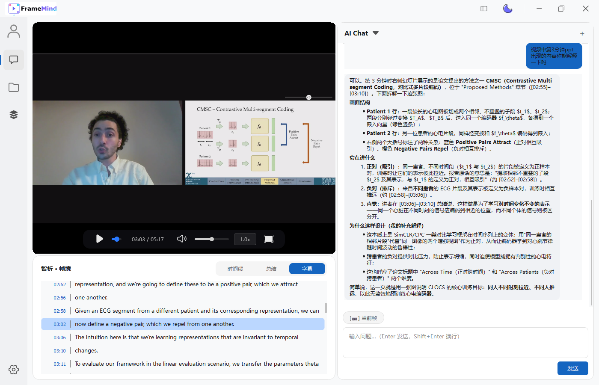
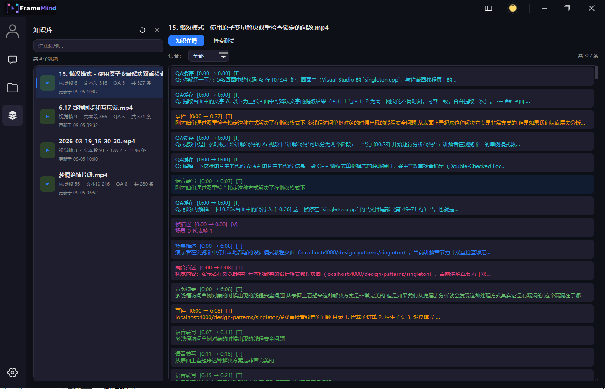

<div align="center">

# 🎬 FrameMind

**智能视频分析 AI Agent 桌面客户端**

基于 Qt 6.9 + FFmpeg + 多模态大模型的视频理解与智能问答系统

[功能特性](#-功能特性) • [效果展示](#-效果展示) • [系统架构](#-系统架构) • [快速开始](#-快速开始) • [开发计划](#-开发计划)

</div>

---

## 📸 效果展示

### 主界面 - 视频播放与 AI 对话



*智能三栏布局：左侧文件管理，中央高性能视频播放器，右侧 AI 对话面板*

### 知识库 - 视频内容索引与检索



*场景时间轴、语音转写、实体追踪、向量检索一体化知识库*

---

## ✨ 功能特性

### 🎥 高性能视频播放
- ✅ **多格式支持** - 基于 FFmpeg，支持 MP4/AVI/MKV/MOV 等主流格式
- ✅ **流畅播放** - 硬件加速解码，60fps 流畅播放
- ✅ **精确控制** - 毫秒级 seek、倍速播放（0.25x - 2.0x）、音量调节
- ✅ **实时预览** - 拖拽进度条时显示帧预览

### 🤖 智能 AI 对话
- ✅ **多模态理解** - 支持图文混合输入，理解视频画面内容
- ✅ **流式回复** - SSE 流式传输，实时展示 AI 思考过程
- ✅ **Markdown 渲染** - 支持代码高亮、表格、引用块等丰富格式
- ✅ **多会话管理** - 按视频分组的对话历史，支持新建/切换/删除
- ✅ **快捷提问** - 6 个预设问题模板，降低使用门槛
  - 总结视频主要内容
  - 这一段发生了什么
  - 识别画面中的物体
  - 提取画面中的文字
  - 分析人物动作
  - 对比帧差异

### 🧠 Video RAG Agent
- ✅ **渐进式索引** - 三级索引（元信息 → 场景分割 → VLM 描述）
  - **Level 0** - 元信息 + 场景分割（秒级完成）
  - **Level 1** - CLIP 视觉编码 + Whisper 语音转写（后台异步）
  - **Level 2** - VLM 场景描述 + 全视频摘要（按需生成）
- ✅ **多路检索融合** - 视觉 + 文本 + 实体，RRF 排序
- ✅ **Agent 决策循环** - 五阶段工作流
  - **PERCEIVE** - 问题分类与采样规划
  - **REPRESENT** - 视频表示构建
  - **REASON** - 推理与规划
  - **ACT** - 工具调用执行
  - **REFLECT** - 反思与验证
- ✅ **Tool Calling** - 6 个专用工具
  - `seek_and_analyze` - 跳转并分析特定时间点
  - `analyze_time_range` - 分析时间段内容
  - `search_video_content` - 向量检索视频片段
  - `get_transcript` - 获取语音转写文本
  - `get_scene_info` - 查询场景信息
  - `control_player` - 控制播放器操作

### 🎨 现代化 UI
- ✅ **深色/浅色主题** - 完整主题系统，一键切换
- ✅ **响应式布局** - 智能三栏布局，支持折叠/展开
- ✅ **丰富交互** - 操作栏（复制/重新生成）、悬停效果、loading 动画
- ✅ **时间段选择器** - 可视化选择分析范围，支持快速选择（前后 5/10/30/60 秒）
- ✅ **实时状态** - AI 分析进度、耗时统计、流式传输指示

### 💾 数据持久化
- ✅ **对话历史** - SQLite 本地存储，支持多会话管理
- ✅ **视频索引缓存** - 场景描述、融合信息、摘要持久化
- ✅ **安全存储** - API Key 使用 Windows DPAPI 加密，不入数据库/日志
- ✅ **向量索引** - 本地向量数据库，支持语义检索

---

## 🏗 系统架构

### 分层架构图

```
┌────────────────────── Presentation Layer ──────────────────────┐
│  MainWindow                                                     │
│  ├── Sidebar (文件管理 + 设置)                                   │
│  ├── PlayerView (视频播放器 + 时间轴)                            │
│  └── ChatView (AI 对话面板)                                      │
└─────────────────────────┬───────────────────────────────────────┘
                          │
┌─────────────────────── ViewModel Layer ────────────────────────┐
│  PlayerViewModel │ ChatViewModel │ VideoAnalysisViewModel      │
└─────────────────────────┬───────────────────────────────────────┘
                          │
┌──────────────────────── Service Layer ─────────────────────────┐
│                                                                 │
│  ┌─── Agent Core ───────────────────────────────────────┐     │
│  │  VideoAgent (五阶段协调器)                            │     │
│  │  ├── PerceptionStrategy (问题分类 + 采样规划)        │     │
│  │  ├── ToolOrchestrator (多轮 Tool Calling)           │     │
│  │  └── ReflectionEngine (事实校验 + 幻觉检测)         │     │
│  └──────────────────────────────────────────────────────┘     │
│                                                                 │
│  ┌─── Video Analysis ──────────────────────────────────┐     │
│  │  VideoIndexer (渐进式索引 L0/L1/L2)                 │     │
│  │  VideoAnalysisService (VLM 场景描述 + 摘要)         │     │
│  │  EntityTracker (实体追踪与共指消解)                 │     │
│  └──────────────────────────────────────────────────────┘     │
│                                                                 │
│  ┌─── RAG System ──────────────────────────────────────┐     │
│  │  VideoRAGStore (4 集合统一存储)                      │     │
│  │  VideoRAGRetriever (多路召回 + RRF 融合)            │     │
│  │  QACacheManager (QA 缓存，阈值 0.88)                │     │
│  └──────────────────────────────────────────────────────┘     │
│                                                                 │
│  ┌─── AI Services ─────────────────────────────────────┐     │
│  │  AgentService (SSE 流式 + Tool Calling)             │     │
│  │  LLMProviderService (多提供商管理)                  │     │
│  │  CLIPService / EmbeddingService / WhisperService    │     │
│  └──────────────────────────────────────────────────────┘     │
│                                                                 │
│  PlayerService │ ConversationService │ ThemeService            │
└─────────────────────────┬───────────────────────────────────────┘
                          │
┌───────────────────── Infrastructure ───────────────────────────┐
│  NetworkClient (HTTP + SSE)                                     │
│  DatabaseManager (SQLite)                                       │
│  ONNXRuntimeEngine (本地推理)                                   │
│  EventBus │ ImageProcessor                                      │
└─────────────────────────────────────────────────────────────────┘
```

### Agent 决策循环

```
用户提问
   │
   ▼
┌─────────────────┐
│   PERCEIVE      │  问题分类 + 采样规划
│                 │  13 种 QuestionType
└────────┬────────┘
         │
         ▼
┌─────────────────┐
│   REPRESENT     │  视频表示构建
│                 │  感知层 → 结构层 → 语义层
└────────┬────────┘
         │
         ▼
┌─────────────────┐
│    REASON       │  RAG 检索 + 上下文组装
│                 │  多路召回 + RRF 融合
└────────┬────────┘
         │
         ▼
┌─────────────────┐
│     ACT         │  Tool Calling (≤5 轮)
│                 │  6 个专用工具
└────────┬────────┘
         │
         ▼
┌─────────────────┐
│   REFLECT       │  事实一致性 + 证据支撑
│                 │  时间合理性 + 幻觉检测
└────────┬────────┘
         │
         ▼
      最终回答
```

### 三层视频表示金字塔

```
┌──────────────────────────────────────────┐
│         语义层 (Semantic Layer)           │
│  VideoSummary / SceneDescriptions /      │
│  EventChain / EntityProfiles             │
└──────────────────┬───────────────────────┘
                   │
┌──────────────────▼───────────────────────┐
│        结构层 (Structural Layer)          │
│  SceneGraph / EntityRegistry /           │
│  SpeechSegments / TemporalIndex          │
└──────────────────┬───────────────────────┘
                   │
┌──────────────────▼───────────────────────┐
│        感知层 (Perceptual Layer)          │
│  原始帧 / CLIP Embedding / 音频 / 光流    │
└──────────────────────────────────────────┘
```

---

## 🚀 快速开始

### 环境要求

| 依赖项 | 版本要求 | 说明 |
|--------|---------|------|
| **Qt** | 6.9+ | Core, Gui, Widgets, Network, Sql, Concurrent, Svg |
| **CMake** | 3.20+ | 构建系统 |
| **编译器** | MSVC 2019/2022 (x64) | Windows 平台 |
| **SmartPlayer SDK** | - | 预编译产物，置于 `third_party/smartplayer_sdk/` |
| **ONNX Runtime** | 1.16+ | 可选，用于本地模型推理 (CLIP/BGE) |
| **whisper.cpp** | - | 可选，用于语音转写 |

### 安装依赖

1. **安装 Qt 6.9**
   ```powershell
   # 下载 Qt Online Installer
   # 选择 MSVC 2019 64-bit 组件
   ```

2. **准备 SmartPlayer SDK**
   ```
   third_party/smartplayer_sdk/
   ├── include/   # smartplayer.h / smartplayercallback.h / smartplayerdefs.h
   ├── lib/       # SmartPlayerSDK.lib
   └── bin/       # SmartPlayerSDK.dll + FFmpeg/SDL2 运行时 dll
   ```

3. **（可选）ONNX Runtime**
   ```powershell
   # 下载并解压到
   third_party/onnxruntime/
   ├── include/
   └── lib/
   ```

### 编译项目

```powershell
# 基础编译（不含本地模型）
cmake -S . -B build -G "Visual Studio 17 2022" -A x64 ^
      -DCMAKE_PREFIX_PATH="C:/Qt/6.9.0/msvc2019_64"

cmake --build build --config Debug
```

**启用本地模型支持：**

```powershell
cmake -S . -B build -G "Visual Studio 17 2022" -A x64 ^
      -DCMAKE_PREFIX_PATH="C:/Qt/6.9.0/msvc2019_64" ^
      -DFRAMEMIND_ENABLE_ONNX=ON ^
      -DFRAMEMIND_ENABLE_WHISPER=ON

cmake --build build --config Debug
```

> 💡 将 `CMAKE_PREFIX_PATH` 替换为你本机的 Qt 安装路径

### 运行应用

```powershell
# 进入构建目录
cd build\Debug

# 运行程序
.\FrameMind.exe
```

**首次使用配置：**

1. 点击菜单 **文件 → AI 设置**
2. 填写 LLM 配置：
   - **Endpoint**: API 服务地址
   - **模型名称**: 如 `gpt-4-vision-preview`
   - **API Key**: 你的 API 密钥（自动加密存储）
3. 点击 **保存** 完成配置

**开始使用：**

1. 点击 **文件 → 打开视频**，选择本地视频文件
2. 等待视频索引完成（进度显示在顶部）
3. 在右侧 AI 对话框中提问或使用快捷按钮

---

## 📚 详细文档

| 文档 | 说明 |
|------|------|
| [快捷功能使用指南](docs/快捷功能使用指南.md) | 输入框快捷按钮详细说明 |
| [新增快捷功能说明](docs/新增快捷功能说明.md) | 快捷功能设计文档 |
| [UI 增强设计](docs/chat-ui-enhancement.md) | 聊天气泡 UI 增强方案 |
| [Agent 核心设计](docs/agent-core-design.md) | Agent 决策循环详解 |
| [Video RAG 方案](docs/video-rag-plan.md) | RAG 检索系统设计 |
| [开发任务卡](docs/dev-tasks.md) | 功能开发进度跟踪 |

---

## 🛣 开发计划

### 当前进度（v1.1.0）

- ✅ **M1 - 基础骨架** - 视频播放 + 三栏布局
- ✅ **M2 - AI 问答** - 单帧截图提问 + 对话历史
- ✅ **M3 - Agent 框架** - 五阶段决策循环 + Tool Calling
- ✅ **M4 - RAG 系统** - 渐进式索引 + 多路检索
- 🚧 **M5 - 本地模型** - CLIP/BGE/Whisper 集成（进行中）

### 近期计划

- [ ] **接线到 ChatViewModel** - Agent 能力全面接入 UI
- [ ] **索引进度 UI** - 顶部状态条显示索引进度
- [ ] **VLM 独立通道** - 避免与用户对话流互相干扰
- [ ] **Whisper 音频提取** - FFmpeg 音频流处理
- [ ] **场景关键帧持久化** - 释放内存占用，秒级复用
- [ ] **单元测试框架** - 核心算法测试覆盖

### 未来规划

- [ ] **流媒体支持** - RTSP/RTMP 拉流 + 滑动窗口索引
- [ ] **实体追踪可视化** - 时间轴上显示实体出现记录
- [ ] **多视频对比** - 并排播放 + 跨视频问答
- [ ] **导出功能** - 场景描述导出、字幕导出、摘要报告
- [ ] **插件系统** - 支持自定义 Tool 和分析模块
- [ ] **协作功能** - 团队共享知识库和对话历史

---

## 📊 版本迭代记录

### v1.1.0 (2026-09-05) 🎉
**Agent 工作流重构 + UI 全面升级**

#### 新增功能
- ✨ **输入框快捷功能**
  - 💡 快速提问：6 个预设问题模板
  - ⏱ 时间段选择器：可视化时间范围选择
- ✨ **聊天 UI 增强**
  - Markdown 渲染（集成 md4c 库）
  - 代码语法高亮
  - 操作栏（复制/重新生成按钮）
  - 实时状态显示（loading 动画 + 耗时统计）
- ✨ **视频索引持久化**
  - 场景描述缓存
  - 融合信息存储
  - 摘要持久化
- ✨ **Agent 工作流优化**
  - 完善五阶段决策循环
  - 优化上下文预算管理
  - 增强工具编排器

#### 技术改进
- 📦 新增 MarkdownRenderer 和 CodeHighlighter 服务
- 🗄️ 数据库 schema 增强，支持多级索引存储
- 🎨 图标系统（深色/浅色版本）
- ⚡ 批量颜色刷新优化性能
- 🔧 消息模型支持状态和时间统计

#### Bug 修复
- 🐛 修复主题切换时气泡样式错乱
- 🐛 修复流式传输时按钮状态未禁用
- 🐛 修复时间戳格式化精度问题

### v1.0.0 (2026-08-02)
**音视频融合第一期**

- ✅ 纯视觉基线 + 同期 ASR 语义门控
- ✅ 保守融合策略
- ✅ 三类证据分离存储（visual / audio / fused）

### v0.9.0 (2026-08-01)
**Agent 核心优化**

- ✅ 索引流程重构
- ✅ 知识库 UI 完善
- ✅ 播放器与分析联动增强

### v0.8.0 (2026-07-30)
**RAG 场景描述质量优化**

- ✅ 全量场景描述
- ✅ 多帧采样
- ✅ 上下文连贯性增强

### v0.7.0 (2026-07-29)
**视频 RAG Pipeline**

- ✅ 实现视频 RAG pipeline
- ✅ 知识库 UI
- ✅ 播放器功能修复

### v0.6.0 (2026-07-28)
**Agent 骨架搭建**

- ✅ 五阶段决策循环
- ✅ RAG 系统
- ✅ 6 Tool 编排

### v0.5.0 (2026-07-27)
**Video RAG 服务框架**

- ✅ CLIP / BGE / Whisper / 场景检测服务

### v0.4.0 (2026-07-26)
- ✅ 解除帧率 30fps 限制

### v0.3.0 (2026-07-25)
- ✅ UI 优化
- ✅ 大模型配置功能

### v0.2.0 (2026-07-24)
- ✅ Video RAG 方案文档
- ✅ UI 与播放器交互完善

### v0.1.0 (2026-07-20)
- ✅ 项目初始化
- ✅ 基础视频播放功能

---

## 🤝 贡献指南

欢迎提交 Issue 和 Pull Request！

### 开发流程

1. Fork 本仓库
2. 创建功能分支 (`git checkout -b feature/AmazingFeature`)
3. 提交改动 (`git commit -m 'feat: Add some AmazingFeature'`)
4. 推送到分支 (`git push origin feature/AmazingFeature`)
5. 提交 Pull Request

### 代码规范

- 遵循 Qt 代码风格
- 使用有意义的变量和函数命名
- 添加必要的注释和文档
- 提交前运行 linter 和测试

---

## 📄 许可证

本项目采用 MIT 许可证 - 详见 [LICENSE](LICENSE) 文件

---

## 🙏 致谢

- [Qt](https://www.qt.io/) - 跨平台 GUI 框架
- [FFmpeg](https://ffmpeg.org/) - 音视频处理库
- [md4c](https://github.com/mity/md4c) - Markdown 解析库
- [ONNX Runtime](https://onnxruntime.ai/) - 跨平台推理引擎
- [whisper.cpp](https://github.com/ggerganov/whisper.cpp) - 高性能语音识别

---

<div align="center">

**FrameMind** - 让 AI 真正理解视频

Made with ❤️ by FrameMind Team

</div>
