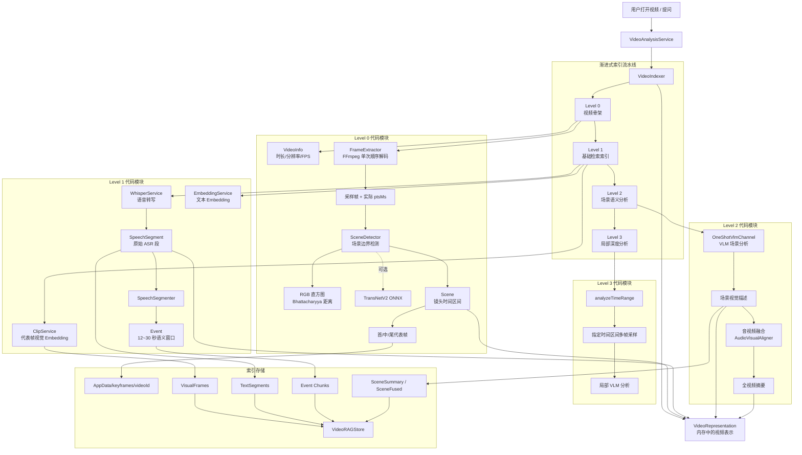
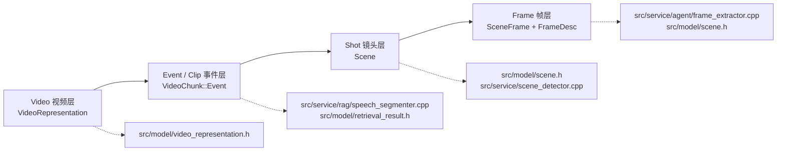
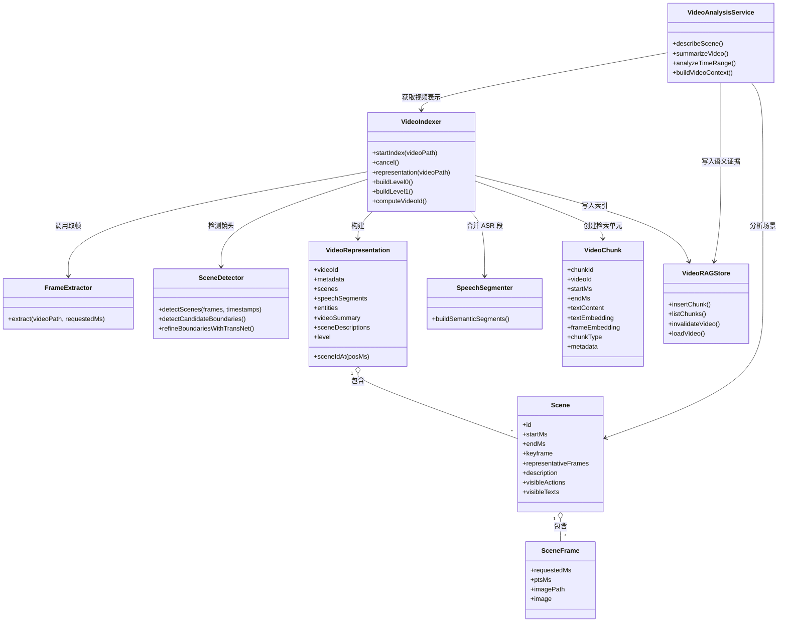
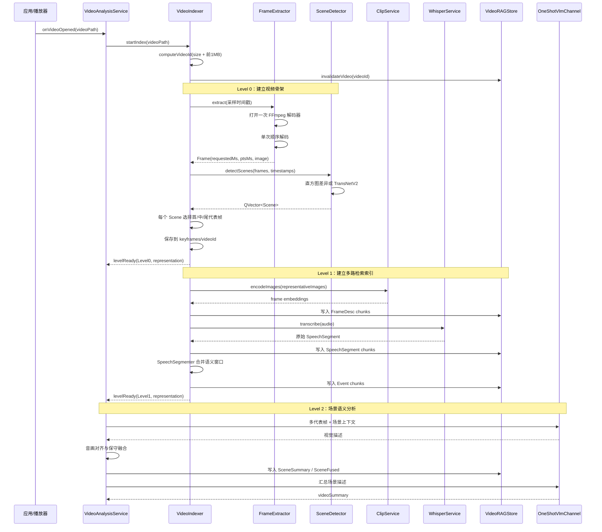
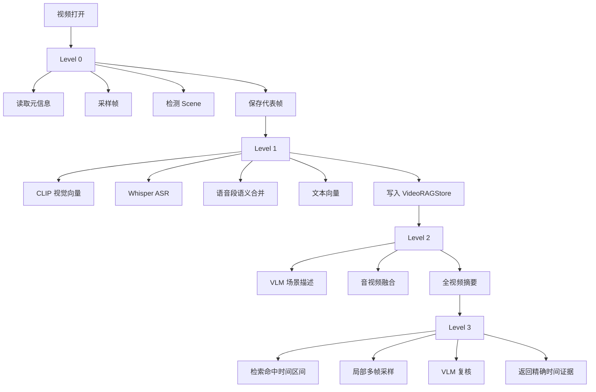

下面这张图以当前代码为准，展示简历第一部分“时序索引”的实际实现结构。重点是把四层索引、渐进式索引流水线和具体代码模块对应起来。

## 一、总体架构图




---

## 二、四层索引和代码的对应关系




| 简历层级         | 代码对象                                                         | 当前作用                               |
| ------------ | ------------------------------------------------------------ | ---------------------------------- |
| `Video`      | `VideoRepresentation`                                        | 保存视频元信息、场景、ASR、实体、摘要和索引等级          |
| `Event/Clip` | `VideoChunk::Event`、`SpeechSegmenter`                        | 将相邻 ASR 段合并为约 12～30 秒语义窗口，服务主题检索   |
| `Shot`       | `Scene`、`SceneDetector`                                      | 表示一段视觉相对稳定的镜头，拥有 `startMs`、`endMs` |
| `Frame`      | `SceneFrame`、`FrameExtractor::Frame`、`VideoChunk::FrameDesc` | 保存实际解码帧、时间戳、图像路径和视觉向量              |


这里要特别注意：

> 当前代码中，`Event/Clip` 的直接实现主要是 ASR 语义窗口；`Scene` 和 `Frame` 是已经比较完整落地的视觉时序结构。基于动作变化自动生成视觉 Event，则由后续 VLM 和局部分析能力继续补充。

---

## 三、核心类之间的关系




---

## 四、一次视频索引的实际执行流程




---

## 五、每个模块具体实现了什么

### 1. `VideoIndexer`

文件：

- `src/service/agent/video_indexer.h`
- `src/service/agent/video_indexer.cpp`

它是整个时序索引的总调度器，负责：

```text
视频打开
  ↓
计算 videoId
  ↓
创建 VideoRepresentation
  ↓
执行 Level 0
  ↓
执行 Level 1
  ↓
通知 VideoAnalysisService 做 Level 2
```

它还负责：

- 管理索引线程池；
- 控制索引进度；
- 处理取消；
- 处理重复打开和缓存命中；
- 使用任务代际号避免旧任务污染新视频；
- 将结果写入 `VideoRAGStore`。

`VideoIndexer` 本身并不负责生成所有语义内容，它更像是索引流水线的编排器。

---

### 2. `FrameExtractor`

文件：

- `src/service/agent/frame_extractor.h`
- `src/service/agent/frame_extractor.cpp`

它负责把视频转换成带时间戳的图像帧：

```text
输入：
视频路径 + 多个目标时间点

输出：
requestedMs
ptsMs
QImage
```

实现上的重点是：

- FFmpeg 文件只打开一次；
- 目标时间戳排序去重；
- 单次顺序解码；
- 使用 `best_effort_timestamp` 获取实际展示时间；
- 使用 `sws_scale` 转换为 RGB；
- 支持 `interrupt_callback` 中断阻塞 I/O；
- 使用 RAII 管理 FFmpeg 资源。

它是时序索引的底层数据获取模块。

---

### 3. `SceneDetector`

文件：

- `src/service/scene_detector.h`
- `src/service/scene_detector.cpp`

它负责从连续采样帧中检测镜头边界。

默认路径：

```text
当前帧
  ↓
缩放到 64×64
  ↓
计算 RGB 直方图
  ↓
Bhattacharyya 距离
  ↓
超过阈值
  ↓
场景边界
```

可选路径：

```text
密集采样帧
  ↓
TransNetV2 ONNX
  ↓
场景切换概率
  ↓
镜头边界
```

输出的是 `QVector<Scene>`，每个 `Scene` 拥有：

- 场景 ID；
- 开始时间；
- 结束时间；
- 首帧关键帧；
- 后续补充的代表帧。

---

### 4. `Scene`

文件：

- `src/model/scene.h`

它是 Shot 层的核心数据结构。

除了时间边界，`Scene` 还预留并承载了语义分析结果：

```text
visualDescription
visibleTexts
visibleActions
audioSummary
fusedDescription
audioRelation
```

这说明 `Scene` 不只是一个切片，还可以逐渐承载：

- 视觉描述；
- 屏幕文字；
- 动作和状态变化；
- 同期音频摘要；
- 音视频融合结果。

---

### 5. `SceneFrame`

`SceneFrame` 是 Scene 内的代表帧：

```text
Scene
 ├── representativeFrames[0]：start
 ├── representativeFrames[1]：middle
 └── representativeFrames[2]：end
```

它保存：

- 请求采样时间；
- 实际解码时间；
- 内存中的 `QImage`；
- 持久化后的图片路径。

首、中、尾三帧的作用是用较低成本表达场景的时间变化。

---

### 6. `SpeechSegmenter`

文件：

- `src/service/rag/speech_segmenter.h`
- `src/service/rag/speech_segmenter.cpp`

它负责把 Whisper 的短 ASR 段合并成适合检索的语义窗口。

约束包括：

```text
最小时长：12 秒
最大时长：30 秒
最大静音间隔：1.2 秒
```

它同时保留两种粒度：

```text
原始 ASR 段：
用于字幕、精确引用和时间对齐

合并后的 Event 段：
用于主题检索和语义召回
```

这是项目中 `Event/Clip` 层最明确的代码实现。

---

### 7. `VideoChunk`

文件：

- `src/model/retrieval_result.h`

`VideoChunk` 是统一的检索单元。不同层级最终都会转成带时间定位的 chunk：

```text
SceneSummary
SpeechSegment
Event
FrameDesc
SceneAudio
SceneFused
```

每个 chunk 至少包含：

```text
chunkId
videoId
startMs
endMs
textContent
metadata
```

视觉 chunk 还可以包含：

```text
frameEmbedding
keyframePath
```

因此四层索引最终被统一到“带时间区间的检索单元”上。

---

### 8. `VideoRAGStore`

文件：

- `src/service/rag/video_rag_store.h`
- `src/service/rag/video_rag_store.cpp`

它负责保存和读取索引结果：

```text
VisualFrames
TextSegments
```

其中：

- 代表帧和视觉 embedding 进入视觉索引；
- ASR、Event、场景描述进入文本索引；
- 每个结果保留 `startMs`、`endMs` 和元数据；
- 后续检索能够回溯到原始视频时间区间。

---

### 9. `VideoAnalysisService`

文件：

- `src/service/agent/video_analysis_service.h`
- 对应实现文件位于 `src/service/agent/` 下

它负责从 Level 1 继续向语义层推进：

```text
Scene 代表帧
  +
同期 ASR
  ↓
VLM 场景描述
  ↓
音视频关系判断
  ↓
SceneFusion
  ↓
写入 SceneSummary / SceneAudio / SceneFused
```

它还提供局部时间区间分析：

```text
analyzeTimeRange(startMs, endMs, focus, sampleCount)
```

这对应架构中的 Level 3：

> 用户提出具体问题后，只对命中的时间区间进行更密集的多帧分析。

---

## 六、渐进式索引和简历描述的对应关系




| 简历描述         | 实际代码                                                                 |
| ------------ | -------------------------------------------------------------------- |
| 视频建模为多模态时序数据 | `VideoRepresentation`、`Scene`、`SpeechSegment`、`SceneFrame`           |
| Video 层      | `VideoRepresentation`、`videoSummary`、`metadata`                      |
| Event/Clip 层 | `SpeechSegmenter`、`VideoChunk::Event`                                |
| Shot 层       | `SceneDetector`、`Scene`                                              |
| Frame 层      | `FrameExtractor`、`SceneFrame`、`FrameDesc`                            |
| 渐进式索引        | `VideoIndexer::buildLevel0()`、`buildLevel1()`、`VideoAnalysisService` |
| 场景理解         | `VideoAnalysisService::describeScene()`                              |
| 全视频摘要        | `VideoAnalysisService::summarizeVideo()`                             |
| 局部时间分析       | `VideoAnalysisService::analyzeTimeRange()`                           |
| 多模态索引        | CLIP、Whisper、EmbeddingService、VLM                                    |
| 时间定位         | `startMs`、`endMs`、`ptsMs`                                            |
| 检索回溯         | `VideoChunk::metadata`、`keyframePath`、`videoId`                      |


---

## 七、你在面试中可以使用的架构总结

> 这部分代码的核心不是简单抽取关键帧，而是建立了一个分层的时序表示系统。`VideoIndexer` 负责组织整个索引流水线，Level 0 通过 `FrameExtractor` 和 `SceneDetector` 建立视频的场景骨架，Level 1 使用 CLIP 和 Whisper 生成视觉、语音和语义窗口索引，Level 2 由 `VideoAnalysisService` 调用 VLM 生成场景描述和全视频摘要，Level 3 再针对用户命中的时间区间进行多帧复核。  
>
> 数据上，`VideoRepresentation` 表示整个视频，`Scene` 表示镜头，`SceneFrame` 表示镜头内的代表帧，`VideoChunk` 则把这些不同粒度的内容统一成带时间区间的检索单元。这样系统可以从 Video 层逐步下钻到 Event、Shot 和 Frame，既支持粗粒度视频摘要，也支持具体到某个时间点的帧级定位。

Error: Connection failed. If the problem persists, please check your internet connection or VPN