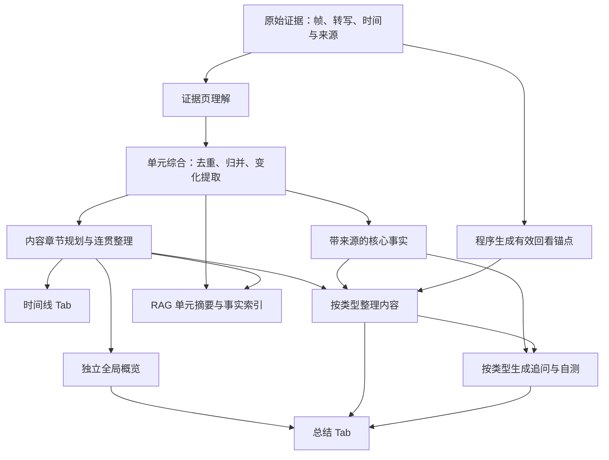

# 视频时间线与类型化总结技术方案

日期：2026-10-02  
状态：设计基线为 2026-10-02；截至 2026-10-03，P1～P8 已完成编码与静态代码审查，P9 运行验收待完成。具体进度见 [实施记录](video-analysis-content-quality-implementation-status.md)。

适用范围：FrameMind 视频分析构建链路、时间线 Tab、总结 Tab、回看与聊天交互

本次修订基线为 2026-10-02 当前工作区，包含未提交的单元并发、滚动上下文、证据网格和网络／构建修复。下文区分已有代码与计划能力；代码存在不等于已经通过最新运行验收。本次文档修订未修改业务代码，未重新构建或运行测试。

## 1. 目标与最终产品形态

本次调整解决三个问题：证据分页结果重复、时间线章节缺乏内容逻辑、总结缺少面向理解与使用的整理。

时间线展示按内容组织的章节：短标题、时间范围、融合描述。章节之间共享上下文，按实际主题、事件或操作推进组织。

总结 Tab 保留现有视频概览卡片、位置和复制入口。概览仍是全片总结，生成结果不得包含分段时间戳、分页 ID 或构建状态。这里的“概览不变”指产品区域和用途不变，先前提出的全片综合与无时间戳要求继续生效。

概览下方移除语义单元／场景描述列表，替换为两个类型化区域：

1. 内容整理：教程为操作笔记，课程为知识笔记，其他类型为观点、事件、剧情等整理。
2. 探索与使用：根据类型提供实践提问、自测、讨论或跟进；会议可同时呈现明确待办。

回看入口融入重要内容条目，以可点击时间标签呈现。通用类型可以直接采用“值得回看＋继续探索”。不再要求每种视频都单独生成 3～5 个推荐卡片。

语义单元、原始帧、ASR 和事实引用继续作为检索与证据层存在。

## 2. 当前实现与具体缺口

| 当前实现 | 缺口 | 调整方向 |
|---|---|---|
| `SemanticUnitBuilder::pages()` 按字符与图片数量分页 | 分页边界服务于请求预算，并非内容边界 | 保留证据分页，增加归并和展示章节 |
| `analyzeUnitPage()` 将 `[pageId] + summary` 追加到 `fusedDescription` | carry 已用于页级衔接与去重，但最终正文仍是拼接，内部 ID 仍直接进入正文；实际去重效果待样本验收 | 页理解单独保存，`fusedDescription` 只保存单元综合结果 |
| `UnitAnalysisTask::results` 已保存成功／失败的 `UnitPageAnalysisResult` | 结果仅在任务内存中，尚无持久化或综合消费 | 统一现有页结果结构与 codec，接入单元综合 |
| 单元页处理结束后更新 coverage、释放 worker，全部任务终态后通过屏障 | 没有主题合并、变化提取、标题校正 | 在现有屏障后增加单元综合阶段 |
| 长主题父单元通过字符串拼接生成描述 | 父子内容重复，长主题进一步膨胀 | 从子单元综合结果归并，或仅作为内部层级关系 |
| `summarizeNext()` 一次最多汇总 8 个输入 | `ChapterSummary` 实际是预算批次，不一定是章节 | 区分中间归约结果和真实内容章节 |
| 汇总 Prompt 要求保留时间线、Partial／失败提示 | 全局概览被写成时间线和构建说明 | 为概览设置独立合同；状态从正文移出 |
| 时间线用 `Scene` 临时包装非 chapter 语义单元 | 展示章节与内部单元绑定，忽略真实章节层 | 新增独立 `VideoChapter`，直接展示 |
| 总结 Tab 监听 `semanticUnitsReady` 并逐项显示正文 | 与时间线重复 | 消费类型化展示数据 |
| 启动重建会重放旧活动构建，`VideoAnalysisViewModel` 在 `summaryReady` 时结束索引状态 | 当前重建就可能被旧摘要提前标为完成；同路径旧构建的 finished 也不能只靠路径过滤 | 展示结果身份与运行任务身份分开，完成状态只由匹配的构建生命周期驱动 |
| 持久化恢复主要加载 summary 和 semanticUnits | 新区域不能仅依赖即时信号 | 保存并恢复完整展示结果 |

代码依据来自当前工作区。旧的场景分析 Prompt 与新构建协调器并存，不能只修改旧 Prompt 而遗漏当前实际执行链路。

### 2.1 已有执行基线

当前主链路为：`start()` → 探测／分类 → `route()` → 原始提取或快照复用 → `segment()`／`correctNext()` → `prepareUnitEvidence()` → `beginUnitAnalysis()`／`scheduleUnits()` → `analyzeUnitPage()` → 全部叶子任务终态屏障 → `finishUnitAnalysis()` → `summarizeNext()` → 编码与发布。

以下能力已经接入代码，应保留并扩展：

- `UnitAnalysisWorkerPool` 提供独立模型客户端；生产默认单元并发为 3，配置 `video_rag.unit_concurrency` 限制为 1～3。一个单元独占 worker，单元内页序严格串行；旧构造路径保持单 worker 兼容。
- `UnitCarryContext` 提供最多 1000 字符的滚动上下文，校验零基页／事实编号、字段白名单和缺口。carry 单独降级不重试主结果，也不因此把成功页改为 Partial。
- `EvidenceGridComposer` 已提供网格、原始帧来源映射、图片准备预算与编码参数；重试复用已准备图片。网格是输入包装，不是新增事实来源。
- 页请求已有显式 requestId、最多一次主结果重试、限流退避、单请求 watchdog、整构建取消、generation 和迟到／重复回调保护。
- 页结果写入固定 unitOrdinal 对应单元，全部叶子任务终态后一次通过屏障。当前屏障后的父单元归并仍为字符串拼接。
- `VideoRAGBuildPlan` 已持久化 `unitUnderstandingVersion`、carry／grid 版本与网格参数，并纳入指纹。当前默认理解版本为 `unit_grid_carry_v2`，旧 JSON 按 legacy 版本解码；分类缓存使用 `profile_v3:` 加模型签名。
- `VideoRagLog` 与 manifest.artifacts 已记录请求、重试、并发、图片准备和耗时，应扩展阶段统计而非另建日志系统。

### 2.2 实施前置修正

1. 将旧活动结果恢复与新运行任务状态分开。当前 `start()` 的旧结果重放会经 Service 发出 summaryReady，VM 随即结束 indexing；这项修复不应等到新增展示阶段后才做。
2. 完整复用除了指纹、视频与类型一致，还要检查所需产物的状态和存在性。当前 `route()` 未检查旧构建 Ready／Partial 和产物完整性，不能将同版本 Partial 自动视为完整复用。
3. 明确更新现有测试预期：当前测试允许全页失败时摘要带错误、摘要失败时输出成功内容摘录；新设计将状态移出正文，需要替换相关断言。
4. 文档中的新增阶段不能覆盖当前网络、并发、carry 和网格修复，也不能引用较早的测试通过记录作为当前工作区的验收结果。

## 3. 分层设计



职责划分：

- 证据层判断“实际观察到了什么”。
- 单元层形成局部理解，保留独立检索能力。
- 展示层决定“如何让用户理解”，可合并多个连续单元。
- UI 渲染已经校验的结构，不负责去重、推断章节或临时调用模型。

内容分析策略与展示策略分开。现有 Documentary、Drama、News、Vlog 均可能走 GenericStrategy，仍可根据 `VideoContentProfile.primaryType` 使用不同展示规则。

## 4. 按类型组织总结下方内容

| 类型／模式 | 内容整理区域 | 探索与使用区域 | 回看优先项 |
|---|---|---|---|
| Tutorial | 操作笔记：目标、前置条件、步骤、注意事项、结果 | 实践与追问：解释步骤、整理执行清单、分析已展示的问题 | 关键操作、结果变化、已展示的错误与修复 |
| Educational | 知识笔记：概念、解释、例子、推导、概念关系 | 复习与自测：理解、比较、应用问题 | 核心概念、典型例题、重要推导 |
| Interview | 观点整理：问题、观点、理由、案例、明确分歧 | 深入讨论：追问论据、观点条件和差异 | 主要观点、支撑案例、关键问答 |
| Presentation | 核心论点：结论、支撑材料、数据和例子 | 理解与追问：论述关系、关键依据、未决问题 | 核心论点和最有代表性的支撑材料 |
| Meeting | 会议纪要：议题、决策、分歧、待确认事项 | 行动与跟进：明确待办＋相关追问 | 决策形成、任务确认、重要分歧 |
| Documentary | 内容脉络：重要对象、背景、事件与信息联系 | 延伸探索：事件原因、关系、解释依据 | 关键事件、重要信息揭示 |
| Drama | 剧情梳理：人物、事件、冲突、转折 | 剧情讨论：动机、伏笔、事件联系 | 转折、关键冲突、信息揭示 |
| News | 事件要点：发生了什么、事件进展、各方表述 | 背景与追问：时间顺序、各方说法、未明确信息 | 核心事实、进展和明确表述 |
| Vlog | 经历与发现：地点、活动、体验、明确建议 | 继续探索：整理经历、提取实用信息 | 代表性体验、明显变化、有用建议 |
| Unknown／通用 | 值得回看：重要主题、事件和变化；偏知识内容可用“内容要点” | 继续探索：内容相关的具体问题 | 内容价值、代表性、差异性 |
| 软件／产品运行展示模式 | 功能与表现：可见功能、状态变化、展示结果 | 继续探索：功能清单、展示效果、可见变化 | 最能体现功能的片段 |

第一版不新增产品展示枚举。软件运行展示作为展示策略的 `demo` 模式，根据真实分析内容选择，不以“出现 IDE／录屏”作为充分条件。

默认继承主类型；在有充分证据说明视频只展示运行效果、没有教学目标和操作过程时选择 demo 模式。用户指定类型继续保留，内部模式不覆盖用户指定的主类型，也不借此推断未展示的步骤。

通用内容整理默认精选 3～5 项，笔记与纪要默认 4～10 项；这些是预算目标，不是硬性数量。短视频可以只有 1～2 项，长笔记可按主题折叠。不要为凑数生成重复内容。

探索问题目标为 3 个，覆盖不同目的。证据不足时允许少于 3 个或隐藏区域，不显示未经支持的占位问题。

## 5. 数据模型与存储

建议新增 `video_presentation_types.h/.cpp`，定义展示数据和 JSON codec。以下是设计字段，不代表现有接口已经实现。

| 类型 | 核心字段 | 用途 |
|---|---|---|
| `UnitPageAnalysisResult`（扩展现有类型） | pageId、pageOrdinal、sourceIds、title、summary、visualDescription、audioSummary、facts、state、error | 保存紧凑页理解，供单元归并；内部使用，error 仅用于诊断 |
| `VideoChapter` | chapterId、startMs、endMs、title、description、unitIds、sourceChunkIds、previousChapterId、nextChapterId、state | 时间线展示，独立于底层 SemanticUnit |
| `VideoReviewAnchor` | anchorId、startMs、endMs、sourceChunkIds、unitIds、precision | 程序建立的回看候选；precision 为 evidence 或 unit |
| `VideoContentPoint` | role、text、sourceChunkIds | 笔记内的步骤、解释、结果、观点等最小内容项 |
| `VideoContentEntry` | entryId、kind、title、body、points、unitIds、sourceChunkIds、anchorId、anchorPointIndex、attributes | 类型化内容条目；锚点必须对应指定主要要点，无入口时序号为 -1 |
| `VideoExploreQuestion` | questionId、text、intent、relatedEntryIds、unitIds、sourceChunkIds | 追问、自测、跟进问题 |
| `VideoSummarySection` | kind、title、state、entries、questions | 统一区域容器；第一块以 entries 为主，第二块以 questions 为主 |
| `VideoPresentation` | schemaVersion、policyId、policyVersion、policySelection、chaptersState、chapters、anchors、primarySection、secondarySection、diagnostics | 完整展示结果；policySelection 保存模式选择依据与状态 |

`attributes` 只允许当前 kind 对应的白名单字段。例如 action_item 允许 owner、deadline，均可为空；不允许模型添加任意 HTML、指令或可执行字段。姓名、日期来自明确证据，unknown 不自动补全。

当前 `src/model/unit_analysis_request.h` 已定义 `UnitPageAnalysisResult`，`UnitAnalysisTask::results` 已收集页结果。第一版统一扩展这一类型，不再平行新增字段相似的 `UnitPageUnderstanding`。为避免 `video_rag_types.h` 与请求头循环依赖，将持久化页结果定义移到 `video_rag_types.h` 或独立的页结果头；`UnitAnalysisRequest` 继续引用统一类型。页序由程序赋值，不能由模型任意填写。

建议扩展：

```cpp
// SemanticUnit 新增：
QVector<UnitPageAnalysisResult> pageUnderstandings;
ArtifactState synthesisState = ArtifactState::Pending;
QJsonArray synthesisPoints; // {text, source_chunk_ids}；不覆盖原始 facts

// VideoBuildManifest 新增：
VideoPresentation presentation;
ArtifactState overviewState = ArtifactState::Pending;

// VideoRAGBuildPlan 新增版本配置：
QString unitSynthesisPromptVersion;
QString chapterPromptVersion;
QString overviewPromptVersion;
QString presentationPolicyVersion;
QString presentationSchemaVersion;
```

`manifest.summary` 保持全局概览的唯一持久化正文。`VideoRepresentation.videoSummary` 继续作为兼容镜像，从 manifest.summary 赋值。不要再在 presentation 中复制一份 overview，以免多份摘要不一致。

`VideoRepresentation` 通过 `build.presentation` 获取章节和区域数据；ViewModel 提供便捷 getter，无需再保存第二套展示字段。

第一版将 presentation 与 overviewState 放入 `video_rag_builds.payload_json`，页理解和 synthesisState 放入现有语义单元 JSON。现有存储已支持 JSON payload，预计无需增加 SQL 表或列；仍需要补齐 codec、读写校验和数据大小限制。

页理解只保存紧凑内容、页序、来源与状态；不保存 workerId、活动 requestId、网格图片、JPEG 数据或请求缓冲。task.results 与 semanticUnit.pageUnderstandings 不应成为长期维护的两套结果源；在屏障处转移结果后，以单元上的持久化结构作为综合输入。失败页保留有限诊断，正文生成只读取成功页及有效事实。

`representationToJson()` 当前主要承担原始快照编码，应保持原始证据语义。展示结果由活动构建恢复，不能只写进原始快照。

所有时间区间统一为 `[startMs, endMs)`，JSON 使用 snake_case。缺少新字段的旧构建解码为 Pending／空数组，不能默认视为已生成。

## 6. 生成链路调整

### 6.1 证据页理解

保留当前“单元间并发、单元内逐页串行”的调度、网格准备、事实引用校验和有限重试。修改 `analyzeUnitPage()`：页结果写入统一页结果容器，不再追加到 fusedDescription，也不把失败原因写入内容正文。页结束继续更新 coverage、carry 和原有统计；单元完成仍释放 worker，不能因等待展示阶段阻塞其余页任务。

事实仍只能引用当前页 source_id。直接沿用已有 `UnitCarryContext` 提供有限的本单元主题、实体、已确认状态和缺口上下文，不新增另一套滚动记忆。carry 不得作为当前页事实来源，也不要求后页只输出新增 facts，以免遗漏独立页证据。carry 单独降级继续不触发主结果重试、不改写成功页覆盖状态。

网格中的格子时间和来源映射由程序生成，facts 只引用原始来源；输入准备失败继续沿用当前页失败机制。网格拆分后的实际页序、页 ID 和来源才是本次结果依据，不能按拆分前的页数推断。

底层 visualDescription、audioSummary 用于追溯和音画关系判断；页 summary 要围绕内容组织。构建协调器中“视觉与语音分开描述”的规则限定到来源字段，不再要求用户摘要也按模态分段。

### 6.2 单元综合

增加 `synthesizeUnit()`：输入当前单元的成功页理解、按时间排列的事实和覆盖状态；输出统一 title、fusedDescription 和带来源的核心要点。

当前页 Prompt 已要求 summary 偏重新增信息，后续页可能省略持续背景。因此综合输入不能只使用 summary 或最终 carry；必须按页序提供有效事实、紧凑页摘要、必要的 visualDescription／audioSummary 和覆盖缺口，补足完整单元的理解。综合核心要点与原有 facts 区分保存，不能以模型归并要点覆盖原始页事实及其引用。

第一版在 `scheduleUnits()` 的现有全部叶子任务终态屏障后，进入 `finishUnitAnalysis()` 的新综合调度；先按 unitOrdinal 顺序通过通用 `request()` 执行综合，再进入章节阶段。页分析继续使用独立工作池，不新增并行综合工作池。这样保留页分析并发和单次屏障语义，同时降低第一版生命周期改造复杂度；综合吞吐优化另行评估。

规则：

- 合并重复实体、功能和持续状态；保留新增变化、事件与重要结果。
- 同一界面持续出现时概括为一次持续展示，不能为每页重新介绍背景。
- 目标、操作、结果之间的关系只有在证据支持时才写入。
- 不将静态帧的前后状态写成实际观察到的点击／执行过程。
- 标题依据整个单元生成，不沿用第一页标题作为最终标题。
- 正文不包含内部 ID、分析覆盖统计、Partial 标签和网络错误。

单元覆盖状态与综合状态分开：全部页处理成功但综合失败，不应伪造 failedPages；构建展示状态可以 Partial。事实和原始证据保持可检索。

父单元仅在叶子综合完成后处理，作为内部层级关系保留时可不再生成冗余全文。叶子判断使用实际 parent／child 关系，不只依赖 kind 字符串或 `parentUnitId.isEmpty()`；当前父单元 kind 为 chapter，而参与父单元的叶子拥有非空 parentUnitId。概览输入和 UnitSummary 索引应明确排除聚合父单元，避免再次双重归并。

超长单元采用带来源和顺序的分层归约；按完整页、完整文本字段或完整事实／要点组切分，不按字符任意截断句子。中间结果在程序侧保留 unitIds、sourceChunkIds、页序和时间范围。单条输入也允许压缩；一组完整原子条目生成一个归约结果。收敛依据归约前后同一最终阶段的实际请求，包含该阶段实际发送的短引用、策略、合同及提示词；字符受限时实际字符数必须下降，token 受限且计数可用时实际文本 token 数必须下降，不用原始 ID 的证据 JSON 字节数代替。仍有最大层数与请求预算约束。无法容纳的单条事实或完整文本字段明确失败，不能截断后充当成功。

2026-10-03 长内容修正：来源集合封装为请求内证据节点，节点到完整来源的映射只保存在程序侧；模型只引用短节点 ID，回复展开为真实来源后再执行合同、来源及关联校验。未知／重复节点或正文中的内部引用拒绝。单元、章节、锚点和条目槽位仍采用短别名。详细区域超限时按完整原始事实／要点分批生成并汇集，不再先压成全片概览式的短证据；操作参数、明确待办属性保留在完整事实内。模型预算按模型／端点签名配置，未知上下文仍采用保守上限，不借用 embedding tokenizer 计数。

### 6.3 展示章节规划

增加 `planChapters()`：基于单元综合结果识别真实主题／事件／步骤边界，输出“连续单元 ID 分组＋章节标题”。模型不直接自由生成章节时间。

程序根据分组确定起止时间、来源和 chapterId，再生成章节描述。第一版允许合并相邻单元，不允许在单元内部随意创造新边界；需要更细章节时沿用已有分段校正或后续增加有证据支持的拆分。

校验要求：

- 单元只能来自当前构建，顺序不可颠倒，不得重复归属。
- 章节只能包含连续叶子单元，不混入父单元造成重复。
- 已分析范围有明确归属；无理解结果的范围呈现独立的不可用状态，不编写内容。
- 时间有序、无重叠，范围有效；关系 ID 由程序生成。
- 内容持续且主题不变时可以合并为一个章节。

对长视频先进行按完整单元切分的局部规划，再对窗口接缝做一次合并判断。窗口使用少量邻接重叠单元，程序按 ID 去重，防止接缝处重复或遗漏。

### 6.4 时间线连贯整理

增加 `refineChapterNarrative()`：输入全片主题、章节提纲、当前章节证据和前后章节概要，生成连贯描述。

短视频一次整理全部章节；长视频使用有上下文的窗口。章节正文用于快速判断本章主题和回看价值，围绕主线概括最重要的新增内容、关键关系或变化及有证据的结论。采用一段2至4句，通常80至180字符，每章上限360字符；短章节允许更短，不为满足结构补造结论。程序逐章校验篇幅与段落，超限按已有有限重试重新概括，不截断正文。

同一概念的定义、解释和例子归并表达；省略重复解释、非必要示例、画面细节和中间计算，不逐页或逐单元复述。课程突出核心概念与原理，教程突出目标、关键方法与结果，会议突出议题与决策，其他类型按其主题、观点、事件或变化概括。原始事实及详细区域保留细节。Ready 单元的章节整理输入只提供其综合正文，不重复附带综合要点；Partial 单元继续保留有效要点。前面已介绍的背景后续不反复展开。时间由卡片单独展示，正文不再写时间区间。

章节生成版本为 chapter_v2_summary，明确重建时不复用旧版本章节及其依赖展示结果，兼容页面和单元综合仍可复用。旧结果继续可读。章节整理失败仍保留代表单元的完整综合正文并标记 Partial／整理未完成，不能截短旧正文冒充成功的重点概括。

章节联结可以是持续、推进、转折、换题，也可以没有明确联系；不能为行文流畅而创造因果。每章仍应可单独阅读，点击定位时不依赖用户必须先读前章。

### 6.5 全局概览

将现有 `summarizeNext()` 拆为内部归约与 `generateOverview()`。归约结果属于构建中间产物，不再自动标记为 ChapterSummary。

流程为完整证据 → 单元理解 → 章节综合 → 必要的多章节主题综合 → 全片概览。完成的章节直接提供综合正文；未完成的章节使用有效单元综合，单元综合不可用时才使用完整原始事实／要点。每次请求按实际完整 envelope 的输入预算组成完整组，不同时重复发送章节正文、所有原始事实和综合要点。

每组中间综合同时有字符和 token 输出上限（默认完整 JSON 1200 字符、768 tokens，且不超过当前输出预留）；下一层只使用上一层综合正文。原始事实和完整范围／来源／覆盖映射由程序保留，后续模型请求不重复传送映射。全部有序输入组均参与下一层，不取前几项充当全片。概览覆盖全片主要主题、核心关系、变化和结论，允许省略次要细节，一般 1～3 段，默认完整回复上限 2400 字符。缺口仅传递存在标记，不编造缺失过程。

输出上限实际下发为请求 max_tokens，并在回复解析后、展开来源前验证长度和 token 数；超限进行有限修复重试，仍失败则保留不可用状态。仍限制归约层数、总请求次数和无进展退出；不能容纳的完整原子事实／文本明确失败，不截断正文冒充成功。

只输出独立的 overview 内容，禁止逐章罗列、时间区间、来源 ID、分页编号和构建说明。正常内容中的版本号、数值或代码不能被粗暴的时间戳正则误删；格式检查只针对明显的分段前缀等泄漏，失败后重试，不用字符串清洗替代综合。

UI 继续通过现有 summaryReady／VideoSummaryCard 展示。

替换当前两条降级路径：`finishUnitAnalysis()` 不再把“成功处理0页”和网络原因写入 manifest.summary；`summarizeNext()` 失败不再拼接或按字符截取输入正文作为概览。失败时 summary 可为空，由 overviewState 和 diagnostics 表达；同视频旧概览如继续展示，必须保留旧 buildId 和旧结果标记，不能写入新构建冒充新概览。

### 6.6 类型化整理与探索

增加 `VideoPresentationPolicyRegistry`，按主类型及实际内容模式选择区域标题、允许的条目 kind、必需／可选字段、选择标准和问题 intent。

建议由 `VideoPresentationBuilder` 封装纯数据输入、Prompt 和校验，协调器只调度生命周期。生成第一块和第二块时，短输入可合并为一次结构化请求；两个区域仍独立校验、独立记录状态，必要时只重试失败区域。

第一块按类型整理完整事实；每个请求按输入额度和详细内容的输出容量分组，超长单元按完整事实／要点拆为多个批次，原始单元身份、时间及覆盖保持不变。无须同时发送相同事实的单元全文与综合要点，也不发送全片提纲作为每批固定负担。

第二块使用当前组的原始事实和相关第一块条目；相关条目仅携带本组能够支持的要点，关系数量过大时按完整条目再分批。新问题关联必须属于实际提交的条目并共享单元和来源；汇集校验使用完整第一块，避免把先前批次的合法关联误判为不存在。各视频类型的标题、kind、role、intent、操作和明确待办验证保持原规则，不统一为课程笔记。自测题需要视频提供足以回答的内容，答案在用户点击后由正常聊天链路检索生成。

策略允许的 kind／intent、展示 schema 和 Prompt 版本在 route 时写入计划，完整进入 fingerprint；demo 等实际内容模式在综合后选择，并在 presentation.policyId 中记录实际选择及依据。完整复用时沿用已验证模式，策略选择规则变化需提升 policyVersion；不能用综合后才得到的模式作为 route 时尚不存在的指纹输入。当前主类型分类规则保持 `profile_v3:` 基线，只有分类合同本身改变时才升级 classifierVersion。

会议第二块允许 entries 中放真实 action_item，并同时提供 questions。不存在明确待办时不出现任务列表，更不能根据概览自行发明责任人或截止时间。

### 6.7 回看锚点

程序先从原始证据生成 anchor 候选，模型只选择 anchorId。ASR 候选使用相关段的起止时间；帧候选使用实际 PTS，并设置合法、有限的播放范围。

候选区间必须与引用来源及关联单元匹配，并在视频时长内。来源分散时不一律选最早证据；优先选择与条目主内容对应的候选。仅有单元级定位时 precision=unit，界面显示“章节起点”而非声称精确定位。

没有可靠锚点的内容条目仍可展示，但不出现可点击时间。重要条目优先带入口，普通说明不强制加时间。

## 7. UI、ViewModel 与交互

### 7.1 时间线 Tab

- 默认模式调整为“内容章节”，直接消费 `VideoChapter`。
- 卡片直接以章节主题作为主标题，不显示“章节1、2、3”；时间范围作为辅助信息，正文使用 PlainText。左侧轨迹与节点、浅色强调背景和窄侧标识共同区分当前章节，避免大面积蓝色覆盖正文。
- 覆盖或理解不足显示为独立小状态，详细原因放入提示／状态区。
- 保留已有点击跳转、播放位置高亮和用户滚动保护。
- 镜头模式可保留用于原有浏览能力，避免把两个数据模型混成 Scene。
- 旧数据没有新章节时提示可重建；不得把带分页 ID 的旧 fusedDescription 再当新章节正文展示。

### 7.2 总结 Tab

保留视频概览卡片，标题及复制入口置于正文卡片外，与第二、三部分的区域标题一致。删除下方 semanticUnitsReady 列表渲染，以及 sceneDescribed 向总结追加场景文本的路径；否则缓存恢复仍会让旧列表重新出现。

新增可复用 `VideoContentSectionWidget`：按各类型 policy 渲染标题，条目用可点击的主题标题和折叠箭头。主区域折叠时只显示标题行，右侧始终显示有有效锚点的无边框回看入口及复制图标，两个操作是展开按钮的同级独立控件；复制图标深色使用 `:/icons/copy_light.png`，浅色使用 `:/icons/copy_dark.png`。主区域展开时直接显示完整要点，避免同时重复显示概述正文，无有效要点的兼容结果将正文作为一条要点展示；复制采用完整要点。Partial 的泛化说明不另占一行，实际状态及提示仍保留；失败等无内容状态继续提供说明。探索区域条目可保留折叠简介与有效回看时间。所有显示变化不修改持久化原文。主区域首次默认展开第一条，其余按用户操作；同视频／构建刷新与主题切换保留展开状态，身份切换清空。会议待办保留负责人与期限等信息，只作为视频信息展示，不新增外部任务写入功能。

新增 `VideoExploreSectionWidget`：按类型显示探索区域标题，问题和轻量“提问 →”入口放在同一张轻量卡片中，长问题换行；会议可在上方附带待办条目。生成或聊天进行中提供明确可用状态，不因空数组自动显示“完整”。第二、三部分均保留真实状态及说明提示，Partial 泛化说明不另占一行；失败等无内容状态继续展示说明。标题行右侧状态留白为 16px，与卡片内部留白一致。

概览与两个区域采用统一的字号、留白、圆角和蓝色强调。浅色卡片背景为 `#F5F7FB`、边框为 `#E4EAF5`，深色由 ThemeService 颜色混合适配；内部布局透明，避免继承页面底色形成色块。折叠／展开条目与问题均使用相同轻量卡片，局部线性图标由 Qt 绘制，不依赖外部资源。顶部完成状态紧跟类型选择器，窄面板保持二者同一行，操作可另起一行；概览只保留标题和复制入口，不重复显示类型标签。视觉更新直接适用于已有有效结果，无需重新生成内容。

构建进度集中于“智析 · 帧境”右侧：仅当前视频正在构建时显示圆环百分比、实际阶段与用时，总结页不再另设进度条。计时由服务从 buildStarted 开始，按构建 ID 读取，终止时冻结；切换 Tab 不重置。构建完成、取消或失败后隐藏整个进度组件并停止刷新计时器，加载已有结果也不显示圆环、结束说明或用时；区域完整性状态独立保留。构建中没有耗时记录时明确显示“耗时未记录”，不伪造零用时。当前实现计时记录只覆盖进程内最近一次构建，不修改存储合同。

标题从受控策略映射取得，不采用模型任意生成的 UI 标题。内容默认 PlainText，避免误把模型文本作为富文本或链接执行。

总结页顶部与第二、三部分共用状态配色：Ready 为柔和绿色，Running 为主题蓝，Partial 为琥珀色，Failed 为柔和红色，Pending／Skipped／Cancelled 为辅助灰；文本状态和诊断仍保留。浅色绿色为 `#247A57`，深色为 `#69C49A`，顶部标签背景与边框由对应状态色低比例混合得到。构建圆环按实际百分比从主题蓝连续过渡到相同绿色，100% 使用绿色；构建结束后仍隐藏。概览复制入口与内容条目共用资源图标、16px 图标尺寸和轻量操作样式，主题切换同步更新。

### 7.3 ViewModel 与信号

2026-10-03 渐进展示：协调器新增携带 `VideoBuildContext` 的 `previewReady`，在完整原始证据提取／复用完成、稳定章节正文批次完成、全片概览校验完成、主区域有效窗口完成及探索区域最终筛选与校验完成时发送展示副本。副本仅在内存使用，带 `display_preview` 标志和递增 revision，不写入活动索引；正式发布仍经过完整校验、派生向量编码和活动版本切换。构建开始／终止语义不因区域提前显示改变。

Service 保存当前运行的最新预览供重新打开视频时恢复；ViewModel 按路径、buildId、taskGeneration 过滤，75ms 合并通知。正式发布、切换视频或新任务启动清理待处理预览，终态先处理最后一个有效展示副本；重建早期保留旧活动内容并独立更新字幕，新章节或概览就绪后切换为新构建预览。失败／取消有旧活动结果时回到旧结果；首次构建则在当前页面保留有效预览并标记未完成，不将其作为可检索的活动 RAG。

Pending／Running 区域显示等待生成／正在整理，已完成区域独立展示真实状态，不把等待误标为 Partial。章节和主区域按稳定 ID 复用未变化卡片，字幕按视频及时间范围识别已有行，保留展开状态、阅读锚点及高亮；内容刷新不主动跟随播放滚动，播放位置事件继续按原规则跟随。概览只在完整回复解析、校验成功后显示。探索问题经最终筛选再显示，预览期间禁用提问并提示“索引就绪后可提问”；最终活动索引就绪再开放。回看验证当前展示副本与视频指纹、条目／锚点关联及合法时间范围，不强制用旧活动索引覆盖预览。

建议新增：

```cpp
VideoPresentation presentation() const;
QVector<VideoChapter> chapters() const;

// Service 信号携带身份：
void presentationReady(const QString& filePath,
                       const QString& buildId,
                       const VideoPresentation& presentation);

// VM 面向 UI：
void presentationChanged(const VideoPresentation& presentation);

// 总结 UI 请求：
void seekRequested(const QString& videoId,
                   const QString& buildId, const QString& anchorId);
void questionRequested(const QString& videoId,
                       const QString& buildId, const QString& questionId);
```

信号只是通知；Widget 绑定时必须通过 getter 恢复现有状态。切换视频时清空章节、区域、问题和锚点；候选异步回调检查 filePath、buildId 和任务 generation，拒绝旧视频／旧任务结果。明确的活动结果恢复按展示身份校验，允许显示同视频的旧活动构建，不将其当作新任务终态。

summaryReady 只意味着概览可显示，不能结束整次构建。构建完成、失败或取消统一通过携带运行身份的终态事件改变 indexing 状态；当前 buildFinished／协调器 finished 的兼容关系见下文。进度区域可以折叠，但仍需能看到剩余内容生成状态。

这里必须区分两类身份：

- 展示身份：已发布活动构建的 videoId／buildId，用于概览、章节、内容条目、回看和问题。
- 运行身份：当前 start() 请求的 filePath／buildId／taskGeneration，用于进度、取消和终态。

现有 `published` 既用于新发布，也用于启动时恢复旧活动结果；旧结果恢复不能结束正在运行的新任务。建议新增带 VideoBuildContext 的 buildStarted、buildProgress、buildTerminated 信号，终态同时携带实际结果 manifest。已有 finished／buildFinished 保留兼容转发，但 VM 的运行状态只消费匹配运行身份的事件。完整命中缓存时，终态属于本次运行任务，结果 manifest 可以属于此前活动构建，不能因两者 buildId 不同而忽略正确完成。

VM 的 summaryReady 可继续保留面向 Widget 的兼容信号；Service 到 VM 的结果通知应携带 filePath／buildId，并从同一 representation 快照更新所有区域。现有路径判断和摘要字符串相等判断不足以识别同路径重建。切视频或同路径新任务启动时，迟到的旧 progress／finished 也应被过滤。

`SummaryTabWidget::onSummaryReady()` 当前会隐藏进度区域，必须改为由匹配任务的 indexing 与各阶段状态决定。启动重建时可以继续显示同视频旧活动结果并标明正在重建；旧结果、候选状态与新发布结果不得互相覆盖身份。初次绑定时统一恢复概览、profile、buildState 和 presentation，而非只重放摘要。

### 7.4 回看与聊天

MainWindow 接收 UI 请求，按当前 VM 数据解析 anchorId／questionId 并校验视频与构建身份。

回看通过现有 `PlayerViewModel::seekAndPlay()` 执行，沿用时间线和字幕交互。

追问展开聊天区、显示当前视频聊天上下文，调用现有 `ChatViewModel::sendMessage(question.text)`。聊天历史中显示用户可读问题，不拼接内部 UUID 或完整笔记正文。

现有 ChatViewModel 已走 VideoAgent＋RAG，无需为推荐问题新增另一套问答通道。第一版问答按当前活动构建检索；点击前核对 buildId。若构建已经改变，刷新问题并提示再点击，避免使用陈旧问题上下文。

聊天生成期间禁用问题按钮，防止连续点击重复发起请求；流式结束后恢复。若后续需要按条目范围限定检索，再扩展正式的 RetrievalHints 参数，不能把内部提示混进问题文本冒充用户输入。

## 8. 存储、索引与兼容升级

### 8.1 原子发布

展示结果跟随 manifest 作为同一候选构建保存，沿用 `saveUnitBatch()`＋`publishBuild()` 的活动版本检查。存储层补充章节、条目、来源、锚点引用校验，不能只相信模型层已校验。

当前两者分别使用事务：saveUnitBatch 保存候选数据，publishBuild 校验 expectedActiveBuildId 后切换活动版本。这里的原子性指活动读者只看到同一已发布 buildId 的结果，不表示两步已合为一个 SQL 事务。发布竞争失败可留下不可见候选数据，但不能替换旧活动版本。

现有 saveUnitBatch 已校验单元身份、关系及 sourceChunkIds 是否属于 raw snapshot；派生 chunk 主要校验视频／构建／快照身份。新增校验须覆盖完整 presentation、页理解、综合要点及正式 ChapterSummary 的来源与关联，包括重复 ID、未知来源、跨构建引用、章节覆盖与合法锚点范围。无效内容引用拒绝保存；仅锚点无效且条目来源有效时，移除入口并记录诊断。限制单页、单元和 manifest 的 payload 大小，避免只限制模型输入而无限扩大持久化结果。

构建失败或取消保留上一个活动构建；新构建有效内容可以以 Partial 发布。发布后载入的 summary、chapters、notes、questions 必须来自同一 buildId。

第一版可以在整个构建完成后发布新展示数据；若要渐进展示，必须用明确标记的候选构建状态，不能把不同版本片段混进活动数据。

### 8.2 恢复路径

补齐协调器启动时旧构建恢复、VideoIndexer::representation() 持久化恢复、VideoAnalysisService published 转发、VideoAnalysisViewModel 缓存重放和 Widget 初次绑定。

从 activeBuild.presentation 恢复新区域。保持 raw snapshot 的职责不变，保证重启后不用再次调用模型也能显示已生成结果。

2026-10-03 恢复规则修正：展示恢复与完整生成复用分开。视频文件指纹一致且已有 Ready／Partial 活动结果时，普通打开直接恢复可读副本并结束本次运行，不因概览、区域或综合失败自动调用模型；损坏区域沿用 restoredBuild 的校验和重建提示。首次无结果、文件变化、显式重建、清除类型覆盖或类型覆盖与活动类型不同，才进入生成。显式重建仍检查原始证据复用条件，来源重新编号为固定长度快照 ID 加序号，不叠加历史 ID。

章节保存可选 incomplete_reasons，区分页理解失败、能力证据缺失、单元综合未完成、章节划分及正文整理未完成。章节整理成功不能掩盖底层综合失败；旧 Partial 无具体原因时仅提示“部分内容整理未完成”，不推断覆盖缺口。

### 8.3 版本与重建

将综合、章节、概览、展示策略及 schema 版本纳入 `VideoRAGBuildPlan::toJson()` 和 fingerprint。新增字段默认兼容解码，但新版本缺少展示数据时不可命中“完整复用”。修改类型分类规则时同时提升 classifierVersion。

上述字段在已有 unitUnderstandingVersion、carryVersion、gridVersion、网格参数、模型版本和 analysisPrompt 的基础上追加，不删除现有指纹维度。旧 JSON 缺字段继续按 legacy／Pending 解码；当前默认 `unit_grid_carry_v2` 只是页理解版本，不代表已具备综合或展示能力。

完整生成复用须同时满足视频、类型、指纹兼容和本版必需产物验收：有效页结果与综合状态、章节、概览、分区及引用均符合合同。Ready／Partial 不能作为唯一条件；证据不足时合法 Skipped／空问题可视为预期结果，Failed／Pending 的必需产物不能冒充完成。展示恢复独立于完整生成复用：普通打开可恢复合法 Partial 并结束；未完成区域等待明确重建，不自动继续生成。

旧构建可保留已有概览和字幕，同时提示“可重新生成章节与笔记”；不恢复旧语义单元正文列表。

第一版沿用已有 forceDerivedRebuild 和原始快照复用规则：在视频身份、采样密度、ASR／模型版本和帧文件可用性兼容时复用提取结果。现有逻辑会重新赋予快照内来源 ID，展示数据必须使用本次实际 ID，不直接搬运旧引用。

2026-10-03 后续修复：显式重建可以逐页复用理解结果，不增加 RebuildScope。仅在同文件原始快照复用、模型与页合同一致时装载缓存；兼容且有效的语义边界可复用。每页持久化 input_fingerprint 和模型 carry_context；指纹覆盖完整页请求、前页衔接上下文、网格映射及实际 JPEG。动态 ID 仅在结构化引用字段规范化，正文不替换。来源按旧新映射恢复并重新校验，失败页或任何指纹不匹配的页重新理解；前页变化可使后页缓存失效。旧快照没有指纹时仍可读，但不能直接复用页面生成。

所有页复用且综合合同一致时，保留有效 Ready 单元综合。全部单元证据和综合保持一致、类型及展示合同兼容时，还可分别复用通过当前验证的 Ready 章节、概览、策略和总结区域；次区域的问题关系依赖主区域，主区域重新生成时不直接搬运旧关联问题。Partial／Failed 区域继续生成，来源、回看锚点、活动 buildId 及派生索引仍使用本次身份。没有断点任务恢复或强制全新生成的独立模式。

### 8.4 RAG 数据

UnitSummary 使用综合后的 fusedDescription，只为叶子单元生成；综合失败的有效代表页降级结果如入库，需标明降级角色与状态。UnitFact 保留有效原始来源，即使没有可用综合正文也不丢弃有效事实。

ChapterSummary 只由真实 VideoChapter 创建，元数据增加 chapter_id、unit_ids、source_chunk_ids 与 derived_summary 角色。预算批次的归约结果不写入 ChapterSummary。

探索问题不作为事实或摘要入库，避免其未证实前提污染检索。类型化笔记第一版无需重复向量化，优先复用单元事实与章节摘要；后续确认有收益再增加独立索引。

父章节单元避免与新展示章节重复索引、重复进入概览输入。保留原有引用关系时，摘要输入和展示明确只处理叶子证据与正式章节。

## 9. 失败、预算与质量控制

| 阶段失败 | 展示与数据行为 |
|---|---|
| 部分页分析失败 | 保留成功证据，状态说明覆盖不足；不把网络错误写进正文 |
| 单元综合失败 | 有成功页时可选一条代表性、有效的页摘要作为明确标记的粗略降级；不拼接所有页；无有效摘要时正文为空 |
| 章节规划失败 | 使用已经综合的叶子单元作为“暂定分段”，可见状态说明未完成章节整理；不得声称是真实操作步骤 |
| 章节连贯整理失败 | 保留有效章节独立综合文本并标 Partial；不把未经证实的连接词加到正文 |
| 概览失败 | 显示概览不可用状态；同视频旧版概览可作为明确标记的旧结果保留；不退回分段文本拼接 |
| 内容整理失败 | 第一块独立提示未生成，时间线和概览保持可用 |
| 问题生成失败 | 第二块提示暂无可用问题或隐藏，不补通用套话凑数 |
| 锚点无效 | 移除跳转入口，保留有来源的内容条目 |

diagnostics 存放错误原因，overviewState、chaptersState 和每个 section.state 表示各区域状态。整体 Ready／Partial 按所需产物计算，避免单一“部分完成”掩盖具体能力。

继续复用现有 ModelReply、隔离请求、有限重试、watchdog、cancel 与 generation 保护。页阶段保持 `requestUnit()` 和独立工作池；第一版新增综合、章节、概览和类型整理阶段使用协调器已有 `request()` 生命周期，不通过聊天通道执行构建。每次新阶段回调仍需检查 current(j)、模型版本和阶段身份，最终发布必须检查视频文件身份及活动版本。

新增预算配置：每页输入、单元归约输入、章节窗口、最终产物大小、最大归约层数和总请求上限。以模型可用上下文为约束，现有字符上限可保留作第二道保护，不能当精确 token 预算。

生成分词器通过 DI 提供，每次构建绑定当前模型／端点签名和文件 SHA-256；原生读取当前生成模型的 HF tokenizer.json（ByteLevel BPE，支持 Isolated Regex／Sequence 与无边界裁剪的 added tokens），不借用 embedding 分词器。system 和 user 文本分别计数；聊天模板、协议及图片占用由 protocol_overhead_tokens 预留，不能宣称图片也已精确分词。缺少匹配文件、格式不支持或上下文未知时继续采用保守字符预算，日志记录原因。配置入口为“AI 设置 → 视频分析输入预算”；底层保存 video_rag.generation_tokenizer.<modelSignature> 和 video_rag.presentation_budget.<modelSignature>。文件算法版本和内容摘要进入 plan.modelVersions.generation_tokenizer，不持久化机器本地分词文件路径到视频产物。

AI 预算设置还提供各阶段字符保护上限、概览输出字符、中间综合字符及 token 上限。plan.modelVersions.content_quality_request 升级为 v4_hierarchy_nodes_typed_batches，请求合同为 content_quality_request_v4_nodes；旧结果继续可读，明确重建时不复用旧展示生成合同的产物，兼容的页面理解仍可复用。

大致调用成本：页分析 P 次＋单元综合约 U 次＋章节窗口整理约 C 次＋必要的概览分层 O 次＋两个类型化区域各自的完整证据／关联批次。次数随内容密度和真实预算增加，不以固定 1～2 次假定详细区域容量。记录各阶段 calls、elapsed、重试、失败、请求输入和输出上限及节点数量。

其中 C 应包括局部章节规划、接缝判断与连贯整理调用，不能直接等同于最终章节数量；以上还未计入已有探测分类、分段校正和重试调用。当前 GenericStrategy.maxUnitMs 为 30000，长视频叶子数 U 可能很大；实施前用真实样本统计网格拆分后的 P、叶子 U 和各阶段调用，评估首版顺序综合的耗时。不能用最终少量章节掩盖逐单元综合成本，也不应为减少请求而扩大到超出证据预算的单元。

沿用 artifacts.unit_analysis 的并发、carry 和网格统计，为 unit_synthesis、chapter_planning、chapter_refinement、overview、primary_section、secondary_section 增加独立 calls／elapsed／retries／failures，并在 publish 时合并保留。按阶段加权更新进度，页阶段完成不提前报告整个构建完成。

第一版对没有事实来源的生成条目直接拒绝；引用与时间校验只证明可追溯，不能证明语义正确。重复度、问题前提和内容准确性仍需真实样本人工验收。

## 10. 文件与模块调整清单

| 文件／模块 | 计划调整 |
|---|---|
| `src/model/video_presentation_types.h/.cpp`（新增） | 展示结构、metatype、JSON 编解码与基本校验 |
| `src/model/video_rag_types.h/.cpp` | 页理解、综合状态、presentation、overviewState、版本与 fingerprint |
| `src/model/unit_analysis_request.h` | 复用请求身份合同；将页结果定义移至统一模型位置，避免循环依赖和重复类型 |
| `src/service/rag/video_presentation_policy_registry.h/.cpp`（新增） | 类型对应的区域、条目 kind、问题 intent 与预算规则 |
| `src/service/rag/video_presentation_builder.h/.cpp`（新增） | 单元综合、章节规划、连贯整理、类型内容与问题的 Prompt／校验辅助 |
| `src/service/agent/video_rag_build_coordinator.h/.cpp` | 保留 scheduleUnits 屏障；调整 analyzeUnitPage／finishUnitAnalysis；拆分综合、章节、概览与展示阶段；增加运行身份事件；移除页正文拼接和旧摘要降级 |
| `src/service/agent/video_rag_build_coordinator_channel.cpp` | 保持页工作池与通用请求生命周期接线，兼容单 worker 路径 |
| `src/service/agent/unit_analysis_worker_pool.h/.cpp`、`src/service/rag/unit_carry_context.h/.cpp`、`src/service/rag/evidence_grid_composer.h/.cpp` | 现有能力沿用；仅在接口适配确有需要时修改，不重做并发、carry 或网格 |
| `src/service/rag/strategies/video_rag_strategy_registry.cpp` | 页 summary 内容规则；初始化新版本；不让音画来源规则割裂正文 |
| `src/service/rag/semantic_unit_builder.h/.cpp` | 保留证据分页及引用校验，必要时提供连续单元／来源范围辅助 |
| `src/service/rag/video_rag_store.cpp` | 页结果、综合要点、展示与派生 chunk 引用校验、payload 大小限制、随构建保存与恢复 |
| `src/service/agent/video_indexer.cpp` | 从活动构建恢复展示结果；更新内存缓存 |
| `src/service/agent/video_analysis_service.h/.cpp` | 新结果信号转发，兼容已有概览信号 |
| `src/viewmodel/videoanalysisviewmodel.h/.cpp` | getter、presentationChanged、缓存恢复、身份过滤和真实完成状态 |
| `src/view/player/timelinetabwidget.h/.cpp` | 默认内容章节，独立卡片模型与状态 |
| `src/view/player/summarytabwidget.h/.cpp` | 保留概览卡片，替换旧列表，新增互动信号 |
| `src/view/player/video_content_section_widget.h/.cpp`（新增） | 内容整理与时间入口渲染 |
| `src/view/player/video_explore_section_widget.h/.cpp`（新增） | 问题、会议跟进与交互状态渲染 |
| `src/view/mainwindow.cpp` | 总结回看、聊天展开、问题发送与 streaming 联动 |
| `tests/video_rag_fixture.h` | 按显式阶段合同生成 mock 响应，避免任何新阶段都被默认 summary 回包掩盖 |
| `tests/video_rag_tests.cpp` | 构建、存储、来源、版本、取消与降级回归 |
| ViewModel／Widget 测试（新增或合适现有 target） | 重建旧结果重放、运行／展示身份、首次绑定恢复、进度与终态、回看和提问交互 |
| `CMakeLists.txt` | 新源文件加入应用和相关测试 target；补充必要 Widget 测试 target |

不需要改动播放器 SDK 或重新实现聊天／模型网络通道。实现时先检查当前未提交的网络与构建修复，基于已有工作继续修改，避免覆盖。

## 11. 实施顺序

| 阶段 | 工作 | 可验收产物 |
|---|---|---|
| 0：生命周期与基线合同 | 修复旧摘要提前结束重建、同路径旧终态／进度过滤；记录当前代码和测试基线 | 旧活动结果可展示，新任务仍正确运行；已有并发／carry／网格保护可回归 |
| A：数据与策略合同 | 新类型、codec、版本、类型规则、锚点校验 | 新旧 JSON 均可读取，所有现有类型可选择展示策略 |
| B：局部与章节理解 | 复用现有页结果、屏障后单元综合、排除聚合父单元、章节规划与上下文整理 | 页并发保持有效；同一持续内容不重复铺陈，时间线由真实内容章节驱动 |
| C：概览与类型总结 | 独立概览、内容条目、问题／待办、分区状态 | 概览无分段时间，笔记／观点等按类型生成 |
| D：存储与兼容 | 活动构建发布、重启恢复、旧版提示、派生重建 | 不重跑模型即可恢复全部已生成区域 |
| E：UI 与交互 | 时间线切换、总结列表替换、时间按钮和聊天提问 | 点击能正确回看或提交问题，切视频不会串内容 |
| F：真实视频验证 | 软件演示、教程、课程、访谈等样本评估与修正 | 同时验证事实准确性、去重、连贯性、类型适配和调用成本 |

上述顺序是开发拆分，功能完整发布应覆盖 0 与 A～F。存储 codec 在 A 阶段接入，D 阶段完成完整发布／恢复与兼容验收；不要到 D 才为前序产物补持久化。只完成 E 无法解决内容质量问题；不能通过换标题、隐藏 ID 或截短正文宣称完成。

优先使用截图对应的软件运行展示视频作为第一条回归样本，再加入一条具有真实操作过程的教程、一条概念＋例题课程和一条访谈，确认共享链路与类型差异同时有效。

## 12. 测试与验收标准

### 12.1 自动化验证

- 多页重复输入最终进入单元综合，并且 UI／索引读取综合结果而非页拼接。mock 测试验证流程与合同，真实去重质量另做样本评估。
- 页 summary 仅描述新增信息时，综合仍能使用早期事实和音画辅助字段恢复持续背景；原始 facts 不被综合要点覆盖。
- 并发额度 1／2／3、单元内页序、固定 unitOrdinal、一次屏障、carry 1000 字符预算与单独降级、网格来源映射、图片重试复用继续回归；新增阶段不持有已释放的页 worker 或请求图片。
- 章节规划拒绝未知单元、非连续分组、重复归属、非法时间和外部构建引用。
- 区域条目与回看锚点只引用当前快照；错误锚点不可点击。
- 各类型策略的必需／可选字段正确，会议未明确的 owner／deadline 保持空。
- 页覆盖成功但综合失败时 coverage 不被错误改写，synthesisState 与整体状态正确。
- 概览、笔记、问题分别失败时降级独立，不出现原始页正文拼接。
- payload 新字段持久化 round trip，重启恢复章节、条目、问题和状态。
- 页结果、综合要点与派生摘要的引用在存储层二次校验；超限 payload、跨快照来源和重复 ID 被拒绝；仅无效锚点可移除入口后保留有效条目。
- 旧构建缺字段可读取，版本升级不能误命中完整复用；派生重建不会破坏有效原始证据。
- 同指纹但必需产物 Failed／Pending 的旧构建不命中完整复用；合法证据不足／Skipped 的分区按合同处理；演示模式策略版本变化使派生产物失效。
- cancel、generation 变化和活动构建竞争继续阻止过期发布。
- Widget 绑定已有 VM 时立即恢复结果；切视频清空；迟到信号无效。
- 强制重建先重放旧活动摘要时，新任务 indexing 保持为 true，进度仍可见；同路径旧 progress／终态不能结束新任务；缓存命中时运行身份与结果 buildId 不同仍能正确完成。
- 点击问题只提交一次用户可读问题，聊天忙时不可重复提交；回看使用正确视频和时间。
- 真实 ChapterSummary 保持来源可检索，探索问题不进入事实索引，既有 QA 缓存版本隔离继续有效。

沿用现有 video_rag_tests 和相关模型通道测试；UI 行为需要适当 Qt Widgets 测试或实际应用验收。设计文档本身不要求运行业务测试。

现有 `tests/video_rag_fixture.h` 通过输入 key／Prompt 文本识别部分请求，未识别阶段默认返回 `{summary: text.left(4000)}`。新增阶段应使用显式阶段名及合同版本，fixture 对未知阶段直接失败，不能让默认 summary 回包掩盖接线错误。

更新 `tests/video_rag_tests.cpp` 中三类旧断言：零成功页摘要包含“成功处理0页”、分析错误直接进入摘要、摘要失败保留全部或分散摘录内容。改为验证 overviewState／diagnostics、空或明确标记的旧概览、各区域独立降级、有效事实继续可检索，且新概览正文不含错误、页 ID 或分段拼接。保留重试有界、取消隔离、活动版本竞争和有效证据不丢失的原意。

已有实现记录中 P0～P3 的构建／测试通过结果早于后续网格等修改；当前文档只确认代码基线，不将旧日志计入本方案验收。实施时先记录新的基线结果，受环境限制无法执行的检查明确列出，再运行与改动相关的测试。

### 12.2 人工内容验收

| 样本 | 预期结果 |
|---|---|
| 持续展示播放器运行效果 | 不按每分钟重复介绍；没有证据时不写开发／操作教程；展示功能与变化 |
| 真实软件教程 | 笔记能对应实际步骤；注意事项与结果有来源；点击能定位操作 |
| 课程 | 知识笔记包含概念、解释和例子；自测可由视频内容回答 |
| 访谈 | 问题与观点关系清楚，论据不被遗漏，未知人物身份不猜测 |
| 会议 | 纪要、明确决策和待办分清，责任人／期限不补造 |
| 纪录片／剧情 | 时间线体现事件展开，未明确原因或动机作为追问而非事实 |
| 无语音／缺少能力 | 只总结可见内容，局部状态说明缺口，不补出不存在的讲解 |
| 长视频 | 章节接缝无重复或遗漏，概览保持全片主题，前半段信息未在递归中丢失 |

完成标准：时间线围绕视频内容连贯展开；概览是全片综合且没有分段时间；总结下方不存在重复语义单元列表；类型化内容实用且可追溯；回看和提问操作可用；重启、切视频、取消、部分失败和升级均不会串内容或破坏已有索引。
