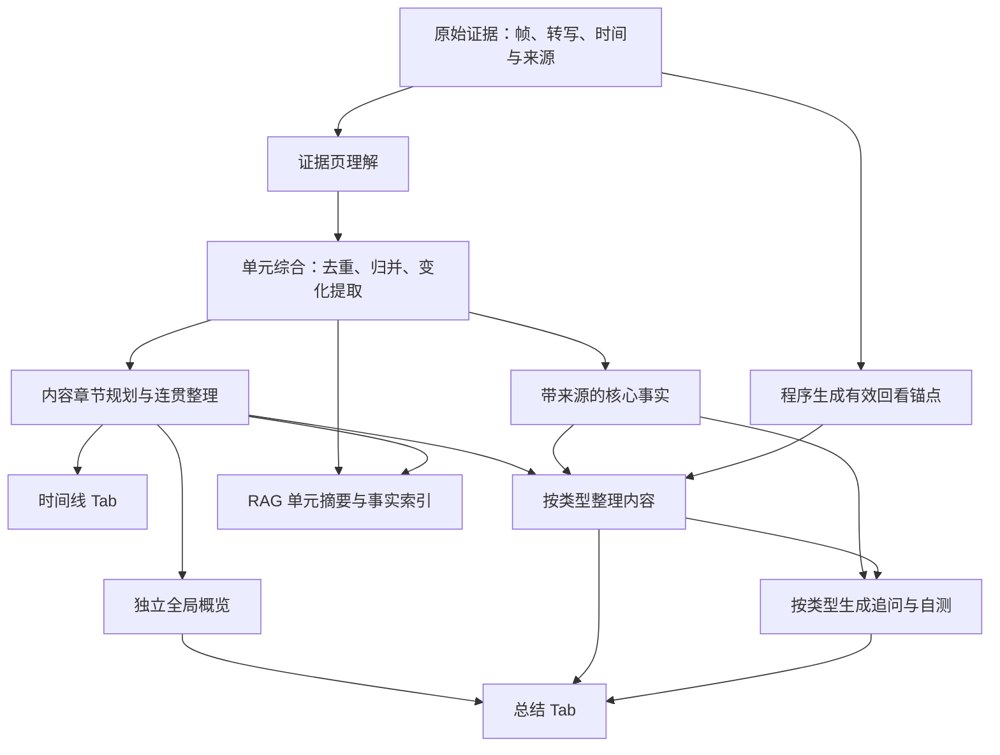

# 视频时间线与类型化总结技术方案

日期：2026-10-02  
状态：设计方案，尚未实施业务代码变更  
适用范围：FrameMind 视频分析构建链路、时间线 Tab、总结 Tab、回看与聊天交互

## 1. 目标与最终产品形态

本次调整解决三个问题：证据分页结果重复、时间线章节缺乏内容逻辑、总结缺少面向理解与使用的整理。

时间线展示按内容组织的章节：短标题、时间范围、融合描述。章节之间共享上下文，按实际主题、事件或操作推进组织。

总结 Tab 保留现有视频概览卡片、位置和复制入口。概览仍是全片总结，生成结果不得包含分段时间戳、分页 ID 或构建状态。这里的“概览不变”指产品区域和用途不变，先前提出的全片综合与无时间戳要求继续生效。

概览下方移除语义单元／场景描述列表，替换为两个类型化区域：

1. 内容整理：教程为操作笔记，课程为知识笔记，其他类型为观点、事件、剧情等整理。
2. 探索与使用：根据类型提供实践提问、自测、讨论或跟进；会议可同时呈现明确待办。

回看入口融入重要内容条目，以可点击时间标签呈现。通用类型可以直接采用“值得回看＋继续探索”。不再要求每种视频都单独生成 3～5 个推荐卡片。

语义单元、原始帧、ASR 和事实引用继续作为检索与证据层存在。

## 2. 当前实现与具体缺口

| 当前实现 | 缺口 | 调整方向 |
|---|---|---|
| `SemanticUnitBuilder::pages()` 按字符与图片数量分页 | 分页边界服务于请求预算，并非内容边界 | 保留证据分页，增加归并和展示章节 |
| `analyzeNext()` 将 `[pageId] + summary` 追加到 `fusedDescription` | 重复描述、内部 ID 直接进入正文 | 页理解单独保存，`fusedDescription` 只保存单元综合结果 |
| 单元结束只更新覆盖状态 | 没有主题合并、变化提取、标题校正 | 增加单元综合阶段 |
| 长主题父单元通过字符串拼接生成描述 | 父子内容重复，长主题进一步膨胀 | 从子单元综合结果归并，或仅作为内部层级关系 |
| `summarizeNext()` 一次最多汇总 8 个输入 | `ChapterSummary` 实际是预算批次，不一定是章节 | 区分中间归约结果和真实内容章节 |
| 汇总 Prompt 要求保留时间线、Partial／失败提示 | 全局概览被写成时间线和构建说明 | 为概览设置独立合同；状态从正文移出 |
| 时间线用 `Scene` 临时包装非 chapter 语义单元 | 展示章节与内部单元绑定，忽略真实章节层 | 新增独立 `VideoChapter`，直接展示 |
| 总结 Tab 监听 `semanticUnitsReady` 并逐项显示正文 | 与时间线重复 | 消费类型化展示数据 |
| `VideoAnalysisViewModel` 在 `summaryReady` 时结束索引状态 | 新增后续内容阶段后会过早显示完成 | 完成状态只由构建生命周期驱动 |
| 持久化恢复主要加载 summary 和 semanticUnits | 新区域不能仅依赖即时信号 | 保存并恢复完整展示结果 |

代码依据来自当前工作区。旧的场景分析 Prompt 与新构建协调器并存，不能只修改旧 Prompt 而遗漏当前实际执行链路。

## 3. 分层设计



职责划分：

- 证据层判断“实际观察到了什么”。
- 单元层形成局部理解，保留独立检索能力。
- 展示层决定“如何让用户理解”，可合并多个连续单元。
- UI 渲染已经校验的结构，不负责去重、推断章节或临时调用模型。

内容分析策略与展示策略分开。现有 Documentary、Drama、News、Vlog 均可能走 GenericStrategy，仍可根据 `VideoContentProfile.primaryType` 使用不同展示规则。

## 4. 按类型组织总结下方内容

| 类型／模式 | 内容整理区域 | 探索与使用区域 | 回看优先项 |
|---|---|---|---|
| Tutorial | 操作笔记：目标、前置条件、步骤、注意事项、结果 | 实践与追问：解释步骤、整理执行清单、分析已展示的问题 | 关键操作、结果变化、已展示的错误与修复 |
| Educational | 知识笔记：概念、解释、例子、推导、概念关系 | 复习与自测：理解、比较、应用问题 | 核心概念、典型例题、重要推导 |
| Interview | 观点整理：问题、观点、理由、案例、明确分歧 | 深入讨论：追问论据、观点条件和差异 | 主要观点、支撑案例、关键问答 |
| Presentation | 核心论点：结论、支撑材料、数据和例子 | 理解与追问：论述关系、关键依据、未决问题 | 核心论点和最有代表性的支撑材料 |
| Meeting | 会议纪要：议题、决策、分歧、待确认事项 | 行动与跟进：明确待办＋相关追问 | 决策形成、任务确认、重要分歧 |
| Documentary | 内容脉络：重要对象、背景、事件与信息联系 | 延伸探索：事件原因、关系、解释依据 | 关键事件、重要信息揭示 |
| Drama | 剧情梳理：人物、事件、冲突、转折 | 剧情讨论：动机、伏笔、事件联系 | 转折、关键冲突、信息揭示 |
| News | 事件要点：发生了什么、事件进展、各方表述 | 背景与追问：时间顺序、各方说法、未明确信息 | 核心事实、进展和明确表述 |
| Vlog | 经历与发现：地点、活动、体验、明确建议 | 继续探索：整理经历、提取实用信息 | 代表性体验、明显变化、有用建议 |
| Unknown／通用 | 值得回看：重要主题、事件和变化；偏知识内容可用“内容要点” | 继续探索：内容相关的具体问题 | 内容价值、代表性、差异性 |
| 软件／产品运行展示模式 | 功能与表现：可见功能、状态变化、展示结果 | 继续探索：功能清单、展示效果、可见变化 | 最能体现功能的片段 |

第一版不新增产品展示枚举。软件运行展示作为展示策略的 `demo` 模式，根据真实分析内容选择，不以“出现 IDE／录屏”作为充分条件。

默认继承主类型；在有充分证据说明视频只展示运行效果、没有教学目标和操作过程时选择 demo 模式。用户指定类型继续保留，内部模式不覆盖用户指定的主类型，也不借此推断未展示的步骤。

通用内容整理默认精选 3～5 项，笔记与纪要默认 4～10 项；这些是预算目标，不是硬性数量。短视频可以只有 1～2 项，长笔记可按主题折叠。不要为凑数生成重复内容。

探索问题目标为 3 个，覆盖不同目的。证据不足时允许少于 3 个或隐藏区域，不显示未经支持的占位问题。

## 5. 数据模型与存储

建议新增 `video_presentation_types.h/.cpp`，定义展示数据和 JSON codec。以下是设计字段，不代表现有接口已经实现。

| 类型 | 核心字段 | 用途 |
|---|---|---|
| `UnitPageUnderstanding` | pageId、sourceChunkIds、summary、visualDescription、audioSummary、facts、state | 保存紧凑页理解，供单元归并；内部使用 |
| `VideoChapter` | chapterId、startMs、endMs、title、description、unitIds、sourceChunkIds、previousChapterId、nextChapterId、state | 时间线展示，独立于底层 SemanticUnit |
| `VideoReviewAnchor` | anchorId、startMs、endMs、sourceChunkIds、unitIds、precision | 程序建立的回看候选；precision 为 evidence 或 unit |
| `VideoContentPoint` | role、text、sourceChunkIds | 笔记内的步骤、解释、结果、观点等最小内容项 |
| `VideoContentEntry` | entryId、kind、title、body、points、unitIds、sourceChunkIds、anchorId、attributes | 类型化内容条目 |
| `VideoExploreQuestion` | questionId、text、intent、relatedEntryIds、unitIds、sourceChunkIds | 追问、自测、跟进问题 |
| `VideoSummarySection` | kind、title、state、entries、questions | 统一区域容器；第一块以 entries 为主，第二块以 questions 为主 |
| `VideoPresentation` | schemaVersion、policyId、policyVersion、chaptersState、chapters、anchors、primarySection、secondarySection、diagnostics | 完整展示结果 |

`attributes` 只允许当前 kind 对应的白名单字段。例如 action_item 允许 owner、deadline，均可为空；不允许模型添加任意 HTML、指令或可执行字段。姓名、日期来自明确证据，unknown 不自动补全。

建议扩展：

```cpp
// SemanticUnit 新增：
QVector<UnitPageUnderstanding> pageUnderstandings;
ArtifactState synthesisState = ArtifactState::Pending;

// VideoBuildManifest 新增：
VideoPresentation presentation;
ArtifactState overviewState = ArtifactState::Pending;

// VideoRAGBuildPlan 新增版本配置：
QString unitSynthesisPromptVersion;
QString chapterPromptVersion;
QString overviewPromptVersion;
QString presentationPolicyVersion;
QString presentationSchemaVersion;
```

`manifest.summary` 保持全局概览的唯一持久化正文。`VideoRepresentation.videoSummary` 继续作为兼容镜像，从 manifest.summary 赋值。不要再在 presentation 中复制一份 overview，以免多份摘要不一致。

`VideoRepresentation` 通过 `build.presentation` 获取章节和区域数据；ViewModel 提供便捷 getter，无需再保存第二套展示字段。

第一版将 presentation 与 overviewState 放入 `video_rag_builds.payload_json`，页理解和 synthesisState 放入现有语义单元 JSON。现有存储已支持 JSON payload，预计无需增加 SQL 表或列；仍需要补齐 codec、读写校验和数据大小限制。

`representationToJson()` 当前主要承担原始快照编码，应保持原始证据语义。展示结果由活动构建恢复，不能只写进原始快照。

所有时间区间统一为 `[startMs, endMs)`，JSON 使用 snake_case。缺少新字段的旧构建解码为 Pending／空数组，不能默认视为已生成。

## 6. 生成链路调整

### 6.1 证据页理解

保留当前逐页分析、事实引用校验和有限重试。页结果写入 pageUnderstandings，不再追加到 fusedDescription，也不把失败原因写入内容正文。

事实仍只能引用当前页 source_id。可提供有限的“本单元已识别主题／实体”作为理解上下文，但不得因此允许引用其他页来源，也不要求后页只输出新增事实，以免遗漏独立页证据。

底层 visualDescription、audioSummary 用于追溯和音画关系判断；页 summary 要围绕内容组织。构建协调器中“视觉与语音分开描述”的规则限定到来源字段，不再要求用户摘要也按模态分段。

### 6.2 单元综合

增加 `synthesizeUnit()`：输入当前单元的成功页理解、按时间排列的事实和覆盖状态；输出统一 title、fusedDescription 和带来源的核心要点。

规则：

- 合并重复实体、功能和持续状态；保留新增变化、事件与重要结果。
- 同一界面持续出现时概括为一次持续展示，不能为每页重新介绍背景。
- 目标、操作、结果之间的关系只有在证据支持时才写入。
- 不将静态帧的前后状态写成实际观察到的点击／执行过程。
- 标题依据整个单元生成，不沿用第一页标题作为最终标题。
- 正文不包含内部 ID、分析覆盖统计、Partial 标签和网络错误。

单元覆盖状态与综合状态分开：全部页处理成功但综合失败，不应伪造 failedPages；构建展示状态可以 Partial。事实和原始证据保持可检索。

超长单元采用带来源和顺序的分层归约；按完整页或事实组切分，不按字符任意截断句子。中间结果保留 unitIds、sourceChunkIds 和时间范围。每轮必须减少工作量，并配置最大层数与请求预算，避免无法收敛。

### 6.3 展示章节规划

增加 `planChapters()`：基于单元综合结果识别真实主题／事件／步骤边界，输出“连续单元 ID 分组＋章节标题”。模型不直接自由生成章节时间。

程序根据分组确定起止时间、来源和 chapterId，再生成章节描述。第一版允许合并相邻单元，不允许在单元内部随意创造新边界；需要更细章节时沿用已有分段校正或后续增加有证据支持的拆分。

校验要求：

- 单元只能来自当前构建，顺序不可颠倒，不得重复归属。
- 章节只能包含连续叶子单元，不混入父单元造成重复。
- 已分析范围有明确归属；无理解结果的范围呈现独立的不可用状态，不编写内容。
- 时间有序、无重叠，范围有效；关系 ID 由程序生成。
- 内容持续且主题不变时可以合并为一个章节。

对长视频先进行按完整单元切分的局部规划，再对窗口接缝做一次合并判断。窗口使用少量邻接重叠单元，程序按 ID 去重，防止接缝处重复或遗漏。

### 6.4 时间线连贯整理

增加 `refineChapterNarrative()`：输入全片主题、章节提纲、当前章节证据和前后章节概要，生成连贯描述。

短视频一次整理全部章节；长视频使用有上下文的窗口。每章应交代本段内容及新信息，前面已介绍的背景后续不反复展开。时间由卡片单独展示，正文不再写时间区间。

章节联结可以是持续、推进、转折、换题，也可以没有明确联系；不能为行文流畅而创造因果。每章仍应可单独阅读，点击定位时不依赖用户必须先读前章。

### 6.5 全局概览

将现有 `summarizeNext()` 拆为内部归约与 `generateOverview()`。归约结果属于构建中间产物，不再自动标记为 ChapterSummary。

概览输入为全片提纲、各章综合内容和重要事实；不得只输入上一个短摘要。按全片主题、核心内容和结论重新组织，一般 1～3 段；长度随信息量调整。

只输出独立的 overview 内容，禁止逐章罗列、时间区间、来源 ID、分页编号和构建说明。正常内容中的版本号、数值或代码不能被粗暴的时间戳正则误删；格式检查只针对明显的分段前缀等泄漏，失败后重试，不用字符串清洗替代综合。

UI 继续通过现有 summaryReady／VideoSummaryCard 展示。

### 6.6 类型化整理与探索

增加 `VideoPresentationPolicyRegistry`，按主类型及实际内容模式选择区域标题、允许的条目 kind、必需／可选字段、选择标准和问题 intent。

建议由 `VideoPresentationBuilder` 封装纯数据输入、Prompt 和校验，协调器只调度生命周期。生成第一块和第二块时，短输入可合并为一次结构化请求；两个区域仍独立校验、独立记录状态，必要时只重试失败区域。

输入包含核心事实、章节、有效锚点和类型规则。生成条目要有来源，问题要有支撑其前提的来源。自测题需要视频提供足以回答的内容，答案在用户点击后由正常聊天链路检索生成。

会议第二块允许 entries 中放真实 action_item，并同时提供 questions。不存在明确待办时不出现任务列表，更不能根据概览自行发明责任人或截止时间。

### 6.7 回看锚点

程序先从原始证据生成 anchor 候选，模型只选择 anchorId。ASR 候选使用相关段的起止时间；帧候选使用实际 PTS，并设置合法、有限的播放范围。

候选区间必须与引用来源及关联单元匹配，并在视频时长内。来源分散时不一律选最早证据；优先选择与条目主内容对应的候选。仅有单元级定位时 precision=unit，界面显示“章节起点”而非声称精确定位。

没有可靠锚点的内容条目仍可展示，但不出现可点击时间。重要条目优先带入口，普通说明不强制加时间。

## 7. UI、ViewModel 与交互

### 7.1 时间线 Tab

- 默认模式调整为“内容章节”，直接消费 `VideoChapter`。
- 卡片展示章节标题、时间范围和融合描述；正文使用 PlainText。
- 覆盖或理解不足显示为独立小状态，详细原因放入提示／状态区。
- 保留已有点击跳转、播放位置高亮和用户滚动保护。
- 镜头模式可保留用于原有浏览能力，避免把两个数据模型混成 Scene。
- 旧数据没有新章节时提示可重建；不得把带分页 ID 的旧 fusedDescription 再当新章节正文展示。

### 7.2 总结 Tab

保留视频概览卡片。删除下方 semanticUnitsReady 列表渲染，以及 sceneDescribed 向总结追加场景文本的路径；否则缓存恢复仍会让旧列表重新出现。

新增可复用 `VideoContentSectionWidget`：根据 section.kind 渲染标题、条目、要点和时间按钮；笔记条目可展开查看，较长内容可复制。会议待办只作为视频信息展示，不新增外部任务写入功能。

新增 `VideoExploreSectionWidget`：按类型显示探索区域标题和问题按钮；会议可在上方附带待办条目。生成或聊天进行中提供明确可用状态，不因空数组自动显示“完整”。

标题从受控策略映射取得，不采用模型任意生成的 UI 标题。内容默认 PlainText，避免误把模型文本作为富文本或链接执行。

### 7.3 ViewModel 与信号

建议新增：

```cpp
VideoPresentation presentation() const;
QVector<VideoChapter> chapters() const;

// Service 信号携带身份：
void presentationReady(const QString& filePath,
                       const QString& buildId,
                       const VideoPresentation& presentation);

// VM 面向 UI：
void presentationChanged(const VideoPresentation& presentation);

// 总结 UI 请求：
void seekRequested(const QString& videoId,
                   const QString& buildId, const QString& anchorId);
void questionRequested(const QString& videoId,
                       const QString& buildId, const QString& questionId);
```

信号只是通知；Widget 绑定时必须通过 getter 恢复现有状态。切换视频时清空章节、区域、问题和锚点；异步结果检查 filePath、buildId 和任务 generation，拒绝旧视频／旧构建回调。

summaryReady 只意味着概览可显示，不能结束整次构建。构建完成、失败或取消统一通过 buildFinished／协调器 finished 改变 indexing 状态。进度区域可以折叠，但仍需能看到剩余内容生成状态。

### 7.4 回看与聊天

MainWindow 接收 UI 请求，按当前 VM 数据解析 anchorId／questionId 并校验视频与构建身份。

回看通过现有 `PlayerViewModel::seekAndPlay()` 执行，沿用时间线和字幕交互。

追问展开聊天区、显示当前视频聊天上下文，调用现有 `ChatViewModel::sendMessage(question.text)`。聊天历史中显示用户可读问题，不拼接内部 UUID 或完整笔记正文。

现有 ChatViewModel 已走 VideoAgent＋RAG，无需为推荐问题新增另一套问答通道。第一版问答按当前活动构建检索；点击前核对 buildId。若构建已经改变，刷新问题并提示再点击，避免使用陈旧问题上下文。

聊天生成期间禁用问题按钮，防止连续点击重复发起请求；流式结束后恢复。若后续需要按条目范围限定检索，再扩展正式的 RetrievalHints 参数，不能把内部提示混进问题文本冒充用户输入。

## 8. 存储、索引与兼容升级

### 8.1 原子发布

展示结果跟随 manifest 作为同一候选构建保存，沿用 `saveUnitBatch()`＋`publishBuild()` 的活动版本检查。存储层补充章节、条目、来源、锚点引用校验，不能只相信模型层已校验。

构建失败或取消保留上一个活动构建；新构建有效内容可以以 Partial 发布。发布后载入的 summary、chapters、notes、questions 必须来自同一 buildId。

第一版可以在整个构建完成后发布新展示数据；若要渐进展示，必须用明确标记的候选构建状态，不能把不同版本片段混进活动数据。

### 8.2 恢复路径

补齐协调器启动时旧构建恢复、VideoIndexer::representation() 持久化恢复、VideoAnalysisService published 转发、VideoAnalysisViewModel 缓存重放和 Widget 初次绑定。

从 activeBuild.presentation 恢复新区域。保持 raw snapshot 的职责不变，保证重启后不用再次调用模型也能显示已生成结果。

### 8.3 版本与重建

将综合、章节、概览、展示策略及 schema 版本纳入 `VideoRAGBuildPlan::toJson()` 和 fingerprint。新增字段默认兼容解码，但新版本缺少展示数据时不可命中“完整复用”。修改类型分类规则时同时提升 classifierVersion。

旧构建可保留已有概览和字幕，同时提示“可重新生成章节与笔记”；不恢复旧语义单元正文列表。

第一版沿用已有 forceDerivedRebuild 和原始快照复用规则：在视频身份、采样密度、ASR／模型版本和帧文件可用性兼容时复用提取结果。现有逻辑会重新赋予快照内来源 ID，展示数据必须使用本次实际 ID，不直接搬运旧引用。

不要声称当前能够“只重建展示而完全跳过页理解”。这需要单独的 RebuildScope 和页理解版本兼容判定，可在 pageUnderstandings 持久化稳定后作为第二阶段优化。

### 8.4 RAG 数据

UnitSummary 使用综合后的 fusedDescription；UnitFact 保留有效原始来源。

ChapterSummary 只由真实 VideoChapter 创建，元数据增加 chapter_id、unit_ids、source_chunk_ids 与 derived_summary 角色。预算批次的归约结果不写入 ChapterSummary。

探索问题不作为事实或摘要入库，避免其未证实前提污染检索。类型化笔记第一版无需重复向量化，优先复用单元事实与章节摘要；后续确认有收益再增加独立索引。

父章节单元避免与新展示章节重复索引、重复进入概览输入。保留原有引用关系时，摘要输入和展示明确只处理叶子证据与正式章节。

## 9. 失败、预算与质量控制

| 阶段失败 | 展示与数据行为 |
|---|---|
| 部分页分析失败 | 保留成功证据，状态说明覆盖不足；不把网络错误写进正文 |
| 单元综合失败 | 有成功页时可选一条代表性、有效的页摘要作为明确标记的粗略降级；不拼接所有页；无有效摘要时正文为空 |
| 章节规划失败 | 使用已经综合的叶子单元作为“暂定分段”，可见状态说明未完成章节整理；不得声称是真实操作步骤 |
| 章节连贯整理失败 | 保留有效章节独立综合文本并标 Partial；不把未经证实的连接词加到正文 |
| 概览失败 | 显示概览不可用状态；同视频旧版概览可作为明确标记的旧结果保留；不退回分段文本拼接 |
| 内容整理失败 | 第一块独立提示未生成，时间线和概览保持可用 |
| 问题生成失败 | 第二块提示暂无可用问题或隐藏，不补通用套话凑数 |
| 锚点无效 | 移除跳转入口，保留有来源的内容条目 |

diagnostics 存放错误原因，overviewState、chaptersState 和每个 section.state 表示各区域状态。整体 Ready／Partial 按所需产物计算，避免单一“部分完成”掩盖具体能力。

继续复用现有 ModelReply、隔离请求、有限重试、watchdog、cancel 与 generation 保护。新阶段必须使用同一 request() 生命周期，不通过聊天通道偷偷执行构建。

新增预算配置：每页输入、单元归约输入、章节窗口、最终产物大小、最大归约层数和总请求上限。以模型可用上下文为约束，现有字符上限可保留作第二道保护，不能当精确 token 预算。

大致调用成本：现有页分析 P 次＋单元综合约 U 次＋章节窗口整理约 C 次＋概览归约／生成 O 次＋类型化区域约 1～2 次，超长单元可能增加归约调用。记录各阶段 calls、elapsed、重试和失败数量，用实际样本评估预算。

第一版对没有事实来源的生成条目直接拒绝；引用与时间校验只证明可追溯，不能证明语义正确。重复度、问题前提和内容准确性仍需真实样本人工验收。

## 10. 文件与模块调整清单

| 文件／模块 | 计划调整 |
|---|---|
| `src/model/video_presentation_types.h/.cpp`（新增） | 展示结构、metatype、JSON 编解码与基本校验 |
| `src/model/video_rag_types.h/.cpp` | 页理解、综合状态、presentation、overviewState、版本与 fingerprint |
| `src/service/rag/video_presentation_policy_registry.h/.cpp`（新增） | 类型对应的区域、条目 kind、问题 intent 与预算规则 |
| `src/service/rag/video_presentation_builder.h/.cpp`（新增） | 单元综合、章节规划、连贯整理、类型内容与问题的 Prompt／校验辅助 |
| `src/service/agent/video_rag_build_coordinator.h/.cpp` | 拆分阶段与 Job 状态；去掉页正文拼接；安排请求、降级和发布 |
| `src/service/rag/strategies/video_rag_strategy_registry.cpp` | 页 summary 内容规则；初始化新版本；不让音画来源规则割裂正文 |
| `src/service/rag/semantic_unit_builder.h/.cpp` | 保留证据分页及引用校验，必要时提供连续单元／来源范围辅助 |
| `src/service/rag/video_rag_store.cpp` | 展示数据引用校验、随构建保存与恢复 |
| `src/service/agent/video_indexer.cpp` | 从活动构建恢复展示结果；更新内存缓存 |
| `src/service/agent/video_analysis_service.h/.cpp` | 新结果信号转发，兼容已有概览信号 |
| `src/viewmodel/videoanalysisviewmodel.h/.cpp` | getter、presentationChanged、缓存恢复、身份过滤和真实完成状态 |
| `src/view/player/timelinetabwidget.h/.cpp` | 默认内容章节，独立卡片模型与状态 |
| `src/view/player/summarytabwidget.h/.cpp` | 保留概览卡片，替换旧列表，新增互动信号 |
| `src/view/player/video_content_section_widget.h/.cpp`（新增） | 内容整理与时间入口渲染 |
| `src/view/player/video_explore_section_widget.h/.cpp`（新增） | 问题、会议跟进与交互状态渲染 |
| `src/view/mainwindow.cpp` | 总结回看、聊天展开、问题发送与 streaming 联动 |
| `tests/video_rag_fixture.h` | 按显式阶段合同生成 mock 响应，避免任何新阶段都被默认 summary 回包掩盖 |
| `tests/video_rag_tests.cpp` | 构建、存储、来源、版本、取消与降级回归 |
| `CMakeLists.txt` | 新源文件加入应用和相关测试 target；补充必要 Widget 测试 target |

不需要改动播放器 SDK 或重新实现聊天／模型网络通道。实现时先检查当前未提交的网络与构建修复，基于已有工作继续修改，避免覆盖。

## 11. 实施顺序

| 阶段 | 工作 | 可验收产物 |
|---|---|---|
| A：数据与策略合同 | 新类型、codec、版本、类型规则、锚点校验 | 新旧 JSON 均可读取，所有现有类型可选择展示策略 |
| B：局部与章节理解 | 页结果独立保存、单元综合、章节规划、上下文整理 | 同一持续内容不重复铺陈，时间线由真实内容章节驱动 |
| C：概览与类型总结 | 独立概览、内容条目、问题／待办、分区状态 | 概览无分段时间，笔记／观点等按类型生成 |
| D：存储与兼容 | 活动构建发布、重启恢复、旧版提示、派生重建 | 不重跑模型即可恢复全部已生成区域 |
| E：UI 与交互 | 时间线切换、总结列表替换、时间按钮和聊天提问 | 点击能正确回看或提交问题，切视频不会串内容 |
| F：真实视频验证 | 软件演示、教程、课程、访谈等样本评估与修正 | 同时验证事实准确性、去重、连贯性、类型适配和调用成本 |

上述顺序是开发拆分，功能完整发布应覆盖 A～F。只完成 E 无法解决内容质量问题；不能通过换标题、隐藏 ID 或截短正文宣称完成。

优先使用截图对应的软件运行展示视频作为第一条回归样本，再加入一条具有真实操作过程的教程、一条概念＋例题课程和一条访谈，确认共享链路与类型差异同时有效。

## 12. 测试与验收标准

### 12.1 自动化验证

- 多页重复输入最终进入单元综合，并且 UI／索引读取综合结果而非页拼接。mock 测试验证流程与合同，真实去重质量另做样本评估。
- 章节规划拒绝未知单元、非连续分组、重复归属、非法时间和外部构建引用。
- 区域条目与回看锚点只引用当前快照；错误锚点不可点击。
- 各类型策略的必需／可选字段正确，会议未明确的 owner／deadline 保持空。
- 页覆盖成功但综合失败时 coverage 不被错误改写，synthesisState 与整体状态正确。
- 概览、笔记、问题分别失败时降级独立，不出现原始页正文拼接。
- payload 新字段持久化 round trip，重启恢复章节、条目、问题和状态。
- 旧构建缺字段可读取，版本升级不能误命中完整复用；派生重建不会破坏有效原始证据。
- cancel、generation 变化和活动构建竞争继续阻止过期发布。
- Widget 绑定已有 VM 时立即恢复结果；切视频清空；迟到信号无效。
- 点击问题只提交一次用户可读问题，聊天忙时不可重复提交；回看使用正确视频和时间。
- 真实 ChapterSummary 保持来源可检索，探索问题不进入事实索引，既有 QA 缓存版本隔离继续有效。

沿用现有 video_rag_tests 和相关模型通道测试；UI 行为需要适当 Qt Widgets 测试或实际应用验收。设计文档本身不要求运行业务测试。

### 12.2 人工内容验收

| 样本 | 预期结果 |
|---|---|
| 持续展示播放器运行效果 | 不按每分钟重复介绍；没有证据时不写开发／操作教程；展示功能与变化 |
| 真实软件教程 | 笔记能对应实际步骤；注意事项与结果有来源；点击能定位操作 |
| 课程 | 知识笔记包含概念、解释和例子；自测可由视频内容回答 |
| 访谈 | 问题与观点关系清楚，论据不被遗漏，未知人物身份不猜测 |
| 会议 | 纪要、明确决策和待办分清，责任人／期限不补造 |
| 纪录片／剧情 | 时间线体现事件展开，未明确原因或动机作为追问而非事实 |
| 无语音／缺少能力 | 只总结可见内容，局部状态说明缺口，不补出不存在的讲解 |
| 长视频 | 章节接缝无重复或遗漏，概览保持全片主题，前半段信息未在递归中丢失 |

完成标准：时间线围绕视频内容连贯展开；概览是全片综合且没有分段时间；总结下方不存在重复语义单元列表；类型化内容实用且可追溯；回看和提问操作可用；重启、切视频、取消、部分失败和升级均不会串内容或破坏已有索引。
