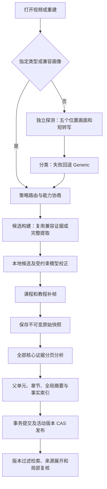

# 类型驱动视频 RAG：实现与验收记录

日期：2026-10-01。代码范围为 P0–P2 公共底座与五种策略；真实模型质量验收尚未完成。

## 默认流程与职责

`VideoAnalysisService::onVideoOpened/analyzeVideo` 统一转发 `VideoRAGBuildCoordinator`。
旧 `VideoIndexer::startIndex/buildLevel0/buildLevel1` 流水线已移除，场景读取保留兼容用途。



| 策略 | 主单元 | 提取及候选分段 | 专用事实 |
|---|---|---|---|
| Meeting | topic | ASR 优先；上下文、停顿、主题过渡，不因镜头强制断开 | 观点、决策、待办、分歧、开放问题 |
| Interview | qa_pair | 共享对话算法；保持问答连续，可跨镜头 | 问题、回答、观点、论据 |
| Lecture | concept | ASR 优先；主题及课件候选；单元内补帧 | 定义、解释、例子、推导 |
| Tutorial | step | 解说及状态候选；2 秒采样，开始/过程/结果补帧，前后关系 | 目标、前置条件、操作、结果、注意事项 |
| Generic | topic | 镜头及转写候选；最长 30 秒，保守概括 | 事件、主题 |

策略只返回计划、参数和 Prompt/schema。提取、请求、分页、校验、归并、embedding、存储、取消和检索共用。

模型通道修复及升级说明见 [video-rag-model-channel-fix.md](video-rag-model-channel-fix.md)。构建任务使用独立 system Prompt；失败原因保留，全部页失败不生成模型摘要。
Lecture 承接 educational/presentation；其余叙事类型由 Generic 承接。
探测每处最多 15 秒音频，合并重叠范围，不拼入完整转写。正式 ASR 按 60 秒区间解码并回写绝对时间。
Meeting/Interview 取帧间隔 30 秒、Lecture 15 秒、Generic 10 秒；保存 requested time 与真实 PTS。

## 接口和版本约定

| 接口或模型 | 职责 |
|---|---|
| `VideoContentProfile` / `VideoRAGBuildPlan` | 分类依据、覆盖、能力、Prompt/schema、模型指纹 |
| `VideoBuildContext` / `BuildOptions` | 文件、build、snapshot、预期版本、generation、取消；指定类型、强制重建、清除覆盖 |
| `SemanticUnit` / `EvidenceCoverage` | 时间、原始引用、镜头、父子与前后关系、事实、成功和失败页 |
| `VideoRAGBuildCoordinator::start/cancel/changeType` | 唯一构建编排及回调上下文校验 |
| `VideoRAGBuildBackend` / `VideoIndexer` | 异步探测、提取、补帧和编码，可注入离线夹具 |
| `VideoAnalysisService::executeBuildRequest` | 带上下文与状态的模型请求，生产环境复用后台串行通道 |
| `VideoRAGStore` | 快照、候选、单元批量提交、事务发布、活动及 legacy 视图 |
| `QueryPlan` / Retriever constraints | build、revision、snapshot、unit、时间及来源展开 |

SQLite 标记为 `rag_schema_version=4`。新增 raw snapshots、builds、semantic units、unit links、type overrides；
metadata 增加活动 build，chunks 增加 build/snapshot。`published_flag` 阻止曾发布构建被候选写入覆盖。
每次重建使用新 build ID，首版发布后的 revision 固定为 1，不支持已发布 build 原地修订。
原始快照不可覆写；复用证据时复制身份并保留原 snapshot/chunk 引用。
发布检查预期活动 build，事务成功后才更新内存。取消、失败及冲突保留原活动版本。
用户覆盖独立保存，即使取消或失败也不丢失；选择“自动”明确清除覆盖。

旧 ChunkType 数值保留，在末尾追加 UnitSummary、UnitFact、TextEvidence、ChapterSummary。
无活动 build 只读取未版本化 legacy chunks；有活动 build 只读取对应 derived/raw。
旧场景恢复明确标 Partial，不用“存在 chunk”推断新流程完整。

## 完整性、线程和查询

- 模型校正须满足真实端点、连续完整覆盖、真实区间来源；修复一次失败后本地回退并记录诊断。
- 证据页记录文本偏移及帧 PTS；核心页全部成功且能力完整才标 Ready，否则 Partial。
- 长主题保留父单元。零成功页跳过摘要；短输入回退只保留一次，长输入取互不重叠的分散摘录。失败原因可见，完整证据仍可展开。
- BGE 使用实际 tokenCount，passage 按 500 token 拆分；超过 512 token 的推理拒绝执行，不静默截断。
- 解码及本地推理在工作线程，模型实例 mutex 串行；数据库、请求调度、规范表示发布在主线程。
- 现有同步查询 API 等待查询向量时仍可能阻塞调用者；构建、补帧和局部解码是异步接口。
- 文件或模型配置在构建期间变化拒绝发布；查询模型指纹不匹配时跳过对应向量路径，保留词面检索。
- 检索按 chunk 身份去重，同时间不同事实保留；派生摘要和事实不计为独立互证。
- 结果带读取版本、单元、原始引文及来源图片；下一步/上一步沿关系展开，显式时间约束优先。
- 普通 Agent 和 workflow 共用 Retriever、EvidenceComposer、语义工具；QA 和 checkpoint 校验 build/revision。
- 操作过程证据不足或单元 Partial 时要求局部复核，静态帧不证明未观察到的点击或输入。

总结页支持自动/指定类型、重建、取消和状态；时间线切换语义单元/镜头；知识库区分完整和部分完成。

## 验证与复现

```powershell
cmake -S . -B build -G "Visual Studio 17 2022" -A x64 -DFRAMEMIND_THIRD_PARTY_ROOT=D:/Qt/ffmpegProjects/FrameMind/third_party
cmake --build build --config Debug --parallel 3
$env:PATH="D:/Qt/6.9.1/msvc2022_64/bin;$env:PATH"
ctest --test-dir build -C Debug --output-on-failure
./scripts/run-video-rag-matrix.ps1 -ThirdPartyRoot D:/Qt/ffmpegProjects/FrameMind/third_party
```

依赖根默认仍为仓库 third_party。测试使用临时 SQLite、生成 PNG/AVI/WAV 和假模型，不访问在线模型或用户数据库。
五策略流水线用例验证执行逻辑，不代替真实视频语义效果评测。

已验证：重复迁移、重启恢复、PTS 序列化、事务回滚、发布冲突、版本不可覆写；静态镜头多主题、
跨镜头问答、步骤关系、分页无遗漏、token 拆分、后半段事实召回；失败页 Partial、摘要失败终止、
旧提取/模型回调丢弃、用户覆盖持久化及自动清除；独立模型请求角色、端点覆盖与指纹刷新、HTTP错误脱敏、串行衔接、LF/CRLF、超时与输出截断；旧版本过滤、QA/checkpoint 失效、同时间事实保留、来源图片展开；
快速切视频、对象销毁、模型配置变化、无音轨/ASR/向量、分类失败回退；独立 seek 取帧和音频区间及尾部完整解码。

`FrameExtractor` 从首个目标附近的关键帧开始解码，五处探测和局部分析不会逐次解码整个视频前缀。
生成 WAV 回归验证 6 秒完整音轨输出 96000 个 16kHz 样本，1234–5678ms 区间输出 71104 个样本。

最终矩阵（MSVC 2022 / Qt 6.9.1 / Debug）已全部通过：

| ONNX | Whisper | 主程序构建 | CTest |
|---|---|---|---|
| ON | ON | 通过 | 4/4 通过 |
| ON | OFF | 通过 | 4/4 通过 |
| OFF | ON | 通过 | 4/4 通过 |
| OFF | OFF | 通过 | 4/4 通过 |

四套测试分别为 video_rag_tests、video_tokenizer_tests、video_model_channel_tests、video_media_tests，合计 27 个业务用例（含数据行，不计初始化/清理）。
日志位于 `build/matrix/*/Testing/Temporary/LastTest.log`；每个目录另保存四份 `video-*-results.xml`，可审查逐例结果。

本地实现提交：`ba40cd8`（版本化底座和构建链路）、`14c57b6`（策略执行、类型控制及离线回归）、
`dc24d9b`（seek 探测及音频完整性修复）。这些是可编译、可验证的实现批次，没有按八个步骤拆成八个独立提交。

## 尚待验收

尚未提供五类真实素材及标注问题，未做在线模型抽检，未测得对旧流程的召回、摘要覆盖、来源支持率、耗时和成本对照。
清单记录 model_calls 和 elapsed_ms，可用于后续对照，但不等于 token 或费用统计。
远端 VLM 指纹对应配置的模型名与 endpoint；服务端同名模型更换权重无法自动识别，需要强制重建。
未完成所有异常路径的穷尽测试及播放器 UI 人工验收。

P3 的叙事专用策略、局部混合路由、专用 OCR、说话人分离、非语音音频事件未实现。
首版状态候选仍使用采样直方图镜头差异，步骤边界及动作判断须用真实素材校准。
本记录确认代码和离线检查，不宣称计划的全部发布质量验收通过。
